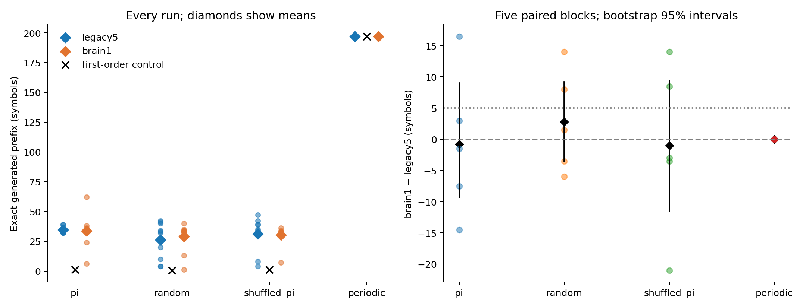
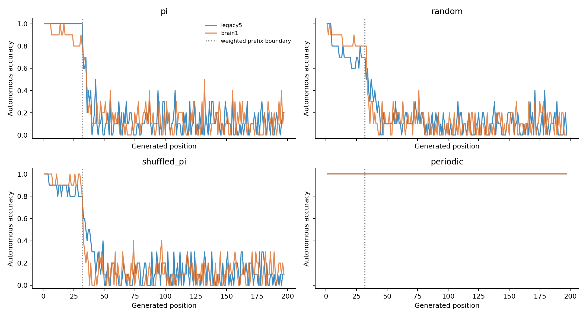

# ACT II — Four-family sequential-memory pilot

**Trained-prefix recall extends beyond pi in this limited pilot, but whole-brain
superiority remains unestablished.** Legacy5/brain1 means were pi34.5/33.7,
random26.0/28.8, shuffled-pi31.2/30.2 and periodic197/197. Both networks pass
the locked limited beyond-pi criterion. No nonperiodic graph comparison passes
the improvement criterion. The first-order control also completes periodic197/197.

Protocol **4038f8f** was committed before outcomes; implementation **2528c9e**.
[Protocol](sequence-memory-protocol.md) · [Exact config](../configs/sequence_memory.json) ·
[Raw results](../results/act2_main/evaluations.csv) · [Analysis](../results/act2_analysis/summary.json).

## 1. Repository audit

Continued from ACT I revision 0a19126, after checking current code, protocol,
results and source graph cache. ACT I numerical source files and recorded
artifacts were unchanged; all 1,030 prior result files passed the final SHA-256
immutability check. New study artifacts use separate directories. Historical
strict ACT I context verification uses revision0a19126 because its verifier
fingerprints the entire source tree, including newly added modules.

## 2. Reproduced baseline

The first archived real fixed-32 condition (s701, model seed1142, offset0),
all three weighted readout initializations, again replayed and independently
refitted to **4 / 35 / 34**. Parameters matched exactly. No best-seed selection.
[Baseline report](../results/act2_baseline/report.json).

## 3. New implementation

Added integer-symbol SequenceDataset sources: pi, random, shuffled_pi and
periodic. Reused the unchanged ACT I graph mapping, frozen rate dynamics,
feature collection and target-free autonomous generator. The dataset layer
supports other alphabet sizes for random/periodic sources; this runner and
all scientific results remain K=10. K=2/4/16 tests are generator tests, not
network generalization experiments. Added simple prediction controls, paired
analysis and exact streaming verification of finalized atomic run artifacts.

## 4. Experiments executed

- Main: four families × legacy5/brain1 × two input-map strata × five paired blocks = **80 fits**.
- Model/dataset seed pairs: 9142/9242 through 9146/9246. Random/shuffle have five realizations; pi and periodic each have one shared realization.
- All lengths200, common prompt314, 199 teacher-forced pairs, 197 autonomous outputs.
- Random suffix is iid conditional on fixed prompt; shuffled_pi preserves the prompt and full pi digit multiset.
- Periodic motif: 3140256789, repeated20 times. It has a deterministic first-order successor rule.
- Exact input root IDs and 48 observed MBON IDs/order match across graphs and families within each block/stratum.
- Frozen incoming-L1 gain.9, leak.6, mbon_after_kc; 48→8 tanh→10 readout, 482 parameters.
- Adam2000 updates, LR.03, L2=1e-5, first32 generated targets weighted4×; final head only.
- Smoke: eight fits, length40/horizon37, 20 updates, block9139/9239, stratum701; excluded from estimates.
- Weighted majority and first-order transition predictors fit the same training pairs, then generate without target lookup.

## 5. Results

Exact-prefix scores exclude prompt and count correct generated symbols before
the first error, capped at197. The name Pi Memory Score applies only to pi.

| Family | Network | Mean | Raw median | Raw variance | Block-bootstrap 95% interval | Mean prefix bits |
|---|---|---:|---:|---:|---|---:|
| pi | legacy5 | 34.50 | 34.50 | 7.39 | [33.00, 36.00] | 114.61 |
| pi | brain1 | 33.70 | 35.00 | 188.23 | [25.70, 42.30] | 111.95 |
| random | legacy5 | 26.00 | 32.50 | 231.78 | [21.40, 32.00] | 86.37 |
| random | brain1 | 28.80 | 33.00 | 144.84 | [22.30, 33.60] | 95.67 |
| shuffled_pi | legacy5 | 31.20 | 34.50 | 198.84 | [23.20, 38.10] | 103.64 |
| shuffled_pi | brain1 | 30.20 | 32.00 | 68.40 | [24.80, 33.30] | 100.32 |
| periodic | legacy5 | 197.00 | 197.00 | 0.00 | [197.00, 197.00] | 654.42 |
| periodic | brain1 | 197.00 | 197.00 | 0.00 | [197.00, 197.00] | 654.42 |

Raw medians/variances describe ten runs. Intervals resample five blocks,
averaging two strata within each block (10,000 resamples, seed9299). Model
and dataset seeds are paired, not fully crossed; their variance components
cannot be separated. These are computational seeds from one connectome.

| Family | Mean brain1−legacy5 | Median delta | Paired 95% interval | d_z | W/T/L | Main criterion |
|---|---:|---:|---|---:|---|---|
| pi | -0.80 | -1.50 | [-9.30, 9.00] | -0.068 | 2/0/3 | False |
| random | +2.80 | +1.50 | [-3.50, 9.20] | 0.340 | 3/0/2 | False |
| shuffled_pi | -1.00 | -3.00 | [-11.60, 9.40] | -0.074 | 2/0/3 | False |
| periodic | +0.00 | +0.00 | [0.00, 0.00] | undefined | 0/5/0 | excluded (predictable ceiling) |

Graph criterion: mean gain>=5 and >=4/5 positive blocks. All nonperiodic
comparisons and the requirement to pass both random and shuffled_pi are
reported without promoting a favorable individual seed.



### Every seed

Each cell is input-map stratum **701 / 702**. These are overlapping samples
of one connectome, not two animals.

**pi**

| Model seed / dataset seed | legacy5 (701/702) | brain1 (701/702) |
|---|---:|---:|
| 9142 / 9242 | 39 / 32 | 36 / 32 |
| 9143 / 9243 | 32 / 32 | 35 / 62 |
| 9144 / 9244 | 32 / 35 | 38 / 35 |
| 9145 / 9245 | 35 / 39 | 24 / 35 |
| 9146 / 9246 | 35 / 34 | 6 / 34 |

**random**

| Model seed / dataset seed | legacy5 (701/702) | brain1 (701/702) |
|---|---:|---:|
| 9142 / 9242 | 33 / 41 | 32 / 35 |
| 9143 / 9243 | 10 / 40 | 13 / 40 |
| 9144 / 9244 | 4 / 42 | 33 / 1 |
| 9145 / 9245 | 20 / 32 | 34 / 34 |
| 9146 / 9246 | 34 / 4 | 33 / 33 |

**shuffled_pi**

| Model seed / dataset seed | legacy5 (701/702) | brain1 (701/702) |
|---|---:|---:|
| 9142 / 9242 | 42 / 8 | 31 / 36 |
| 9143 / 9243 | 4 / 32 | 32 / 32 |
| 9144 / 9244 | 39 / 35 | 33 / 34 |
| 9145 / 9245 | 47 / 34 | 7 / 32 |
| 9146 / 9246 | 39 / 32 | 32 / 33 |

**periodic**

| Model seed / dataset seed | legacy5 (701/702) | brain1 (701/702) |
|---|---:|---:|
| 9142 / 9242 | 197 / 197 | 197 / 197 |
| 9143 / 9243 | 197 / 197 | 197 / 197 |
| 9144 / 9244 | 197 / 197 | 197 / 197 |
| 9145 / 9245 | 197 / 197 | 197 / 197 |
| 9146 / 9246 | 197 / 197 | 197 / 197 |

### Prediction controls and decoding

| Family | Majority prefix | First-order prefix | legacy5 teacher / autonomous accuracy | brain1 teacher / autonomous accuracy |
|---|---:|---:|---|---|
| pi | 0.00 | 1.00 | 83.10% / 26.90% | 78.68% / 26.04% |
| random | 0.00 | 0.60 | 83.10% / 22.03% | 76.09% / 23.35% |
| shuffled_pi | 0.00 | 1.20 | 79.80% / 25.08% | 78.07% / 24.62% |
| periodic | 1.00 | 197.00 | 100.00% / 100.00% | 100.00% / 100.00% |



## 6. Interpretation

The limited beyond-pi criterion requires BOTH random and shuffled_pi mean
prefix>=16, at least4/5 block means>=16, and mean advantage>=5 over the
stronger simple predictor with at least4/5 positive advantages.
- legacy5: limited beyond-pi criterion **True**.
  random: 5/5 blocks reach16; mean control advantage +25.40; criterion True.
  shuffled_pi: 5/5 blocks reach16; mean control advantage +30.00; criterion True.
- brain1: limited beyond-pi criterion **True**.
  random: 5/5 blocks reach16; mean control advantage +28.20; criterion True.
  shuffled_pi: 5/5 blocks reach16; mean control advantage +29.00; criterion True.

Passing this rule supports recall of the sampled trained instances beyond pi;
it is not universal arbitrary-sequence memory or prediction of unseen inputs.
Pi/periodic use fixed sequences, while random/shuffle vary across five seeds.
The periodic first-order control is perfect by construction: a high periodic
score does not require complex long-term storage. In particular,197log2(10)
is a recalled-prefix score, not evidence of654 independent stored bits.
Per-family feature rank, active-state fraction and zero-input decay are
preserved in [diagnostics](../results/act2_analysis/diagnostics.csv) and
[standardized representation measures](../results/act2_analysis/representation.csv).
They are descriptive and do not establish causal memory pathways.

For nonperiodic families, standardized observed-feature effective rank averaged
19.35–19.45 in legacy5 versus14.35–14.41 in brain1. Periodic ranks were lower,
10.10/9.03, despite perfect recall. Thus feature rank alone is not a memory score.
Activity counts use a rate-state threshold, not spikes or physiological firing.
Legacy5 random recall was8.5 symbols below pi on average (paired interval
[-12.8,-3.3]); passing the pilot criterion does not mean equal difficulty across
families. Model and sequence seed variability remain combined.

## 7. Negative findings

No nonperiodic graph comparison met the locked improvement criterion.
The conditional fresh-seed graph-superiority confirmation was therefore not
triggered. No hyperparameter tuning, seed exclusion or success-rule change.
All low-prefix outcomes remain in the raw tables. Individual failures include
brain1 random1, legacy5 random4 and brain1 shuffled-pi7. Brain1 pi ranged6–62;
the isolated62-symbol run is not promoted over its cohort mean33.7.

## 8. What we can claim

These are reproducible results for computational models using actual
Drosophila connectome structure with a fixed observation/readout budget.
The criterion outcomes above concern trained-sequence decoding in these
specific families and computational blocks.

## 9. What we cannot claim

No biological pi memorization, unseen-sequence prediction, internal synaptic
learning, matched-random-topology superiority, memory-critical biological
circuit, formal reservoir memory capacity or Shannon capacity is established.
Length scaling and network-level alphabet generalization remain untested.
The fixed32 weighting can itself shape where exact recall fails.

## 10. Reproducibility

Smoke: eight exact replays and eight exact refits. Main: **80 exact replays, 8 exact independent refits** (first block/first stratum, both networks/all families).
Verification checks symbols, observed trajectories, predictions, probabilities,
feature scaling, zero-input decay, predictor controls and training objectives.
[Verification manifest](../results/act2_verification_v2/manifest.json).
Tests: **141 passed, 8 optional-dependency skips**; no new LIF validation.
Environment: Python3.12.10, NumPy2.3.5, SciPy1.17.0, pandas2.2.3, mpmath1.4.1,
psutil7.2.2, one numerical thread; unchanged requirements-act1-lock.txt.
Main worker wall time sum 976.98s; maximum sampled process-tree RSS 969.1MiB.
Replay ran concurrently with part of the fit cohort. Times are observed wall
times, not isolated benchmarks. No run hit1800s or3GiB. Raw graph caches are
regenerated from pinned source hashes, not bundled with result archives.

One initial streaming-verifier assertion failed because it reduced a C-layout
array whereas the head reduces an advanced-indexed array, changing roundoff
by at most1.73e-17. The verifier now uses the same indexed layout, with exact
comparison retained. Models, outcomes and tolerances were not changed.
[Preserved failure record](../results/act2_verification/failure.json).

From repository root, after installing the existing environment lock:

```powershell
$env:PYTHONPATH = 'src'
python -m flying.training.phase6 prepare --cache outputs/act1-graphs
python -m flying.training.sequence_memory run --out outputs/act2_new
python -m flying.training.sequence_memory verify --out outputs/act2_new --refit
python scripts/summarize_sequence_memory.py --source outputs/act2_new --out outputs/act2_analysis_new
```

Use new directories; existing archives are never overwritten. Per-run manifests
contain dataset symbols/seeds/hashes, exact input/observation root IDs, source
and config hashes, environment, checkpoint/metric paths and timestamp.
[Main manifest](../results/act2_main/manifest.json).
[Final artifact integrity checks](../results/act2_validation/final-checks.json).

## 11. Next highest-information experiment

**A preregistered random-sequence length-scaling comparison of legacy5 and
brain1**, at lengths32,64,128,256,512, retaining paired dataset/model seeds
and observation budgets. Explicitly predeclare how the prefix weighting
window is capped for short sequences. This tests where recall breaks down;
it has not been run here. Do not move to circuit localization or plasticity
before this scaling question is resolved.
