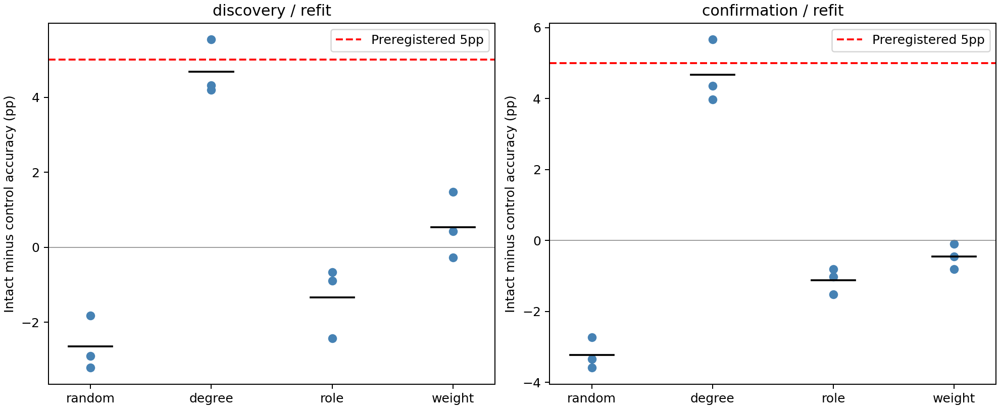
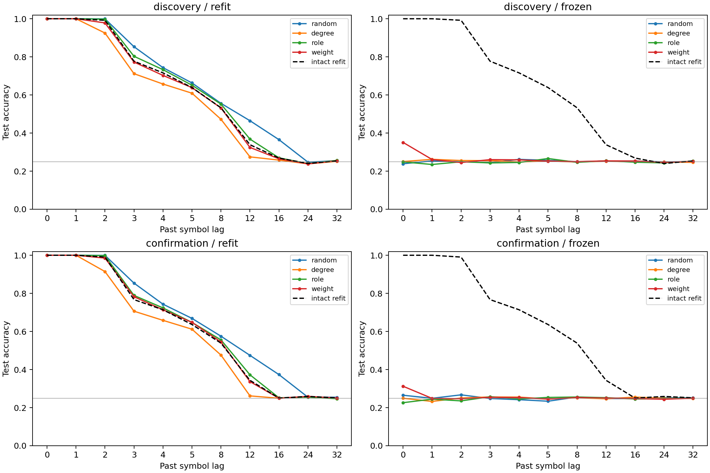

# ACT III-C — 연결량을 보존해도 실제 배선의 이점이 남는가?

**현재 두 부분 모델의 III-C 구조 대조 패널을 실행·검증까지 완료했다.**
주 분석 `refit/role`의 사전 양-cohort 기준 통과: **False**.
전체 확인 목록: `frozen/random, frozen/degree, frozen/role, frozen/weight`.
완료는 지정한 실험의 종료이며, 가설 성공이나 whole-brain 검증을 뜻하지 않는다.

주 분석에서 intact−role control은 본 실험 −1.3278%p, 새 seed 확인 −1.1185%p였다.
모든 6개 seed block에서 role 대조가 더 높았다. 원본 배선이 5%p 이상 좋다는
사전 가설은 실패했다. 반대 방향의 작은 효과는 관찰로 보고하며, 사후에
별도의 대조 우위 가설이 사전 확인됐다고 바꾸어 부르지 않는다.

연결 수만 맞춘 random은 원본보다 2.6417/3.2204%p 높았지만 뉴런별 strength와
역할 구성까지 바뀌므로 이 차이를 특정 topology만의 효과로 해석할 수 없다.
Signed degree와 incoming weights를 맞추되 역할 연결 구성을 풀어준 degree
대조는 원본보다 4.6843/4.6676%p 낮았다. 차이는 모든 seed에서 같은 방향이지만
사전 5%p 기준에는 미달했다. Weight shuffle은 +0.5426/−0.4481%p로 방향도 바뀌었다.
이 결과는 구체적인 원래 연결 상대와 역할별 연결 구성을 구분해 조사할 이유를
주지만, role 대조와 degree 대조의 차이에 새로운 사후 성공 기준을 붙이지 않는다.

Frozen 대조 정확도는 네 family 모두 약25%였고, refit 후에는 약73–81%였다.
확인된 frozen 차이는 원래 해독기의 전이 민감성에 관한 결과다. 상태에 과거 정보가
사라졌다거나 원본 회로만 기억한다는 뜻이 아니다. Effective rank는 intact6.24,
role7.05, degree4.52, random9.41로 관측됐으나 rank와 성능의 관계는 설명용이다.
Rank가 인과적으로 성능 차이를 만들었다고 입증하지 않았다.

Role 재배선은 원래 edge의49.08–50.94%를 여전히 공유한다. Per-neuron incoming
weights는 정확히 보존했지만 outgoing strengths는 보존하지 않는다. Finite swap
sampler의 한계, 두 부분 회로와 n=3씩의 computational blocks라는 범위를 유지한다.
현재 결과로 실제 초파리의 기억이나 지능을 평가하지 않는다.


## 1. Repository audit

III-B 종료 commit `4b1d4d7`에서 AGENTS, 연구 방향·현황·로드맵, 코드와
manifest/checkpoint를 확인했다. 이전 raw-bin DAN 결과에는 유효 제거 가중치량
차이가 있었고, 엄격한 정규화 가중치 대조는 5%p 기준에 미달했다.
이번에는 삭제 대신 재배선하며 핵심 대조에서 뉴런별 incoming weight multiset
(유입 가중치 값들의 목록)을 정확히 보존한다. 과거 outgoing-weight 보존
shuffle과 보존 방향이 다르다. 과거 결과와 합쳐서 성공 여부를 판단하지 않는다.

그래프 예비 검사는 학습 결과 없이 진행했다. Protocol/graph audit는 `5516c80`에
먼저 고정했다. 새 실험·bootstrap seed 106개와 과거 기록의 충돌은 0이다.
별도 예비 graph seed169001은 추론 표본에서 제외한다.

첫 실행은 미사용 과거 `kc_exclusive.py`의 Git/checkout 줄바꿈 차이를 잡아
baseline/새 실험 이전에 중단됐다. 사용하지 않는 스크립트까지 검사한 범위 오류다.
실제 실행·검증 의존성 13개에 대한 exact-byte 검사를 유지하도록 수정했다.
[사전 검사 실패 기록](../results/structural_controls_preflight/failure.json)을 보존했다.
과거 소스와 manifest는 수정하지 않았다. 이후 13,726개 이전
result 파일 해시가 동일함을 확인했다. 결과를 본 뒤 criterion을 바꾸지 않았다.

## 2. Reproduced baseline

기존 `results/structural_k4_main/real_c701_s34142`의 모든 저장 배열과 metric을
정확히 재현했다. Primary 과거 기호 해독 정확도 **75.4833%**.
[Baseline 증거](../results/structural_controls/baseline.json).
기존 Python 환경을 재사용했으며, 이번에 새 clean environment를 설치한 것은 아니다.

## 3. New implementation

[Graph generator](../scripts/structural_controls.py),
[runner](../scripts/run_structural_controls.py),
[independent verifier](../scripts/verify_structural_controls.py),
[tests](../tests/test_structural_controls.py)를 추가했다.
Frozen은 원래 intact의 평균/표준편차와 head를 그대로 적용하고, refit은 바뀐
상태에서 새 head를 학습한다. 내부 연결은 경험으로 학습되지 않는다.

## 4. Experiments executed

각 686뉴런, c701/c702, threshold5, 3309/3241 연결. 두 회로는 서로 다른 동물
표본이 아니라 같은 connectome에서 만든 기존 부분 그래프다.
입력 뉴런·입력 패턴, 관측 48 MBON과 readout 예산은 paired 조건에서 동일하다.
K4 독립 무작위 train/test stream, warmup100, train2000/test1000; smoke만200/100.
Gain0.9 incoming-L1, leak0.6, mbon_after_kc; ridgealpha1,
train-only moments, std floor1e-5, 지연마다196개 계수.
Lags0,1,2,3,4,5,8,12,16,24,32; primary1,2,3,4,5,8.
이는 입력된 과거 기호 해독이며 Pi Memory Score나 자율 회상이 아니다.

| 대조 | 보존 | 바뀌거나 보존하지 않는 것 |
|---|---|---|
| random | 뉴런·연결 수, 전체 signed raw weight 목록 | 뉴런별 degree/strength, 역할 연결 구성, 정규화 계수 |
| degree | 뉴런별 signed in/out degree, 각 뉴런 incoming weight 목록 | 역할 연결 구성, 구체적 상대, outgoing strength |
| role — 주 분석 | degree 대조 특성 + 뉴런별 각 역할과의 signed in/out degree | 구체적 상대와 motif, outgoing strength |
| weight | 정확한 adjacency/sign, 각 뉴런 incoming weight 목록 | 연결 상대별 magnitude 배정, outgoing strength |

각 대조 3개 draw. Intact 포함13arms × (smoke1 + 본6 + 확인6) = **169조건**.
모든 조건 full replay, **156 frozen**, **338 independent train/test trajectories**,
**3575 per-lag metric 행**을 검사했다. Smoke는 통계에서 제외한다.
본 seed161142–161144, 확인171142–171144; 데이터·graph seed는 config에 고정.
두 cohort를 합치지 않고 n=3 block씩 분석한다. Draw/회로/lag를 독립 n으로 세지 않는다.

Degree/role은10E accepted swaps,200E proposal cap. Self loop와 중복 금지.
유한 swap sampler이며 균일한 matched graph 분포나 완전 mixing을 입증한 것은 아니다.
Role은 기존 역할 주석 기준이며 새 biological module 발견을 뜻하지 않는다.
Random은 약한 matching이며 생리적 모델이 아니다.

실행 364.57s, sampled peak RSS 185.22MiB.
독립 검증 115.02s. Sampling RSS는 순간의 절대 최대를 보장하지 않는다.
기본 상한3600s/3GiB. 환경·의존성·CPU·BLAS 정보는 manifest에 있다.

## 5. Results

### 주 분석 seed 표

정확도는 회로·primary lag 평균, 대조는3 draws 평균이다. 양의 차이는 intact 우위.

| Cohort | Seed | Intact % | Role control % | Difference pp |
|---|---|---|---|---|
| discovery | 161142 | 77.2333 | 78.1250 | -0.8917 |
| discovery | 161143 | 78.3417 | 79.0028 | -0.6611 |
| discovery | 161144 | 77.2500 | 79.6806 | -2.4306 |
| confirmation | 171142 | 76.3500 | 77.1611 | -0.8111 |
| confirmation | 171143 | 78.3417 | 79.3667 | -1.0250 |
| confirmation | 171144 | 77.6417 | 79.1611 | -1.5194 |

### 모든 family/mode 통계

차이의 mean/median/variance/95% bootstrap/dz. Variance 단위 (%p)².
Gate는 intact 접근성 + 평균차이≥5%p + 모든 seed 양수이며 같은 mode에서 양 cohort 통과를 요구한다.

| Cohort/mode/family | Mean | Median | Variance | Bootstrap95 | Paired dz | Gate |
|---|---|---|---|---|---|---|
| discovery/refit/random | -2.6417 | -2.8917 | 0.529128 | [-3.2111, -1.8222] | -3.6316 | False |
| discovery/refit/degree | +4.6843 | +4.3167 | 0.555095 | [4.1944, 5.5417] | 6.2872 | False |
| discovery/refit/role | -1.3278 | -0.8917 | 0.925378 | [-2.4306, -0.6611] | -1.3803 | False |
| discovery/refit/weight | +0.5426 | +0.4250 | 0.778428 | [-0.2750, 1.4778] | 0.6150 | False |
| discovery/frozen/random | +52.3370 | +52.7889 | 0.889864 | [51.2528, 52.9694] | 55.4814 | True |
| discovery/frozen/degree | +52.2306 | +52.1556 | 0.375980 | [51.6583, 52.8778] | 85.1809 | True |
| discovery/frozen/role | +52.8546 | +52.0250 | 2.220689 | [51.9639, 54.5750] | 35.4682 | True |
| discovery/frozen/weight | +52.1361 | +52.0417 | 0.184961 | [51.7611, 52.6056] | 121.2266 | True |
| confirmation/refit/random | -3.2204 | -3.3389 | 0.193529 | [-3.5889, -2.7333] | -7.3204 | False |
| confirmation/refit/degree | +4.6676 | +4.3611 | 0.790589 | [3.9722, 5.6694] | 5.2495 | False |
| confirmation/refit/role | -1.1185 | -1.0250 | 0.131993 | [-1.5194, -0.8111] | -3.0787 | False |
| confirmation/refit/weight | -0.4481 | -0.4444 | 0.124462 | [-0.8028, -0.0972] | -1.2703 | False |
| confirmation/frozen/random | +52.5157 | +52.3500 | 1.642688 | [51.3250, 53.8722] | 40.9743 | True |
| confirmation/frozen/degree | +52.5731 | +52.1972 | 1.111553 | [51.7583, 53.7639] | 49.8653 | True |
| confirmation/frozen/role | +52.5713 | +52.5889 | 2.066638 | [51.1250, 54.0000] | 36.5693 | True |
| confirmation/frozen/weight | +52.4407 | +52.8389 | 1.552233 | [51.0444, 53.4389] | 42.0911 | True |

Bootstrap는 n=3 block의 기술 통계다. 작은 표본의 좁은 구간을 강한 모집단 확증으로 해석하지 않는다.

### 전체 paired seed 표

| Cohort | Mode | Family | Seed | Intact % | Control % | Difference pp |
|---|---|---|---|---|---|---|
| discovery | refit | random | 161142 | 77.2333 | 80.1250 | -2.8917 |
| discovery | refit | random | 161143 | 78.3417 | 80.1639 | -1.8222 |
| discovery | refit | random | 161144 | 77.2500 | 80.4611 | -3.2111 |
| discovery | refit | degree | 161142 | 77.2333 | 73.0389 | +4.1944 |
| discovery | refit | degree | 161143 | 78.3417 | 72.8000 | +5.5417 |
| discovery | refit | degree | 161144 | 77.2500 | 72.9333 | +4.3167 |
| discovery | refit | role | 161142 | 77.2333 | 78.1250 | -0.8917 |
| discovery | refit | role | 161143 | 78.3417 | 79.0028 | -0.6611 |
| discovery | refit | role | 161144 | 77.2500 | 79.6806 | -2.4306 |
| discovery | refit | weight | 161142 | 77.2333 | 76.8083 | +0.4250 |
| discovery | refit | weight | 161143 | 78.3417 | 76.8639 | +1.4778 |
| discovery | refit | weight | 161144 | 77.2500 | 77.5250 | -0.2750 |
| discovery | frozen | random | 161142 | 77.2333 | 24.4444 | +52.7889 |
| discovery | frozen | random | 161143 | 78.3417 | 25.3722 | +52.9694 |
| discovery | frozen | random | 161144 | 77.2500 | 25.9972 | +51.2528 |
| discovery | frozen | degree | 161142 | 77.2333 | 25.0778 | +52.1556 |
| discovery | frozen | degree | 161143 | 78.3417 | 25.4639 | +52.8778 |
| discovery | frozen | degree | 161144 | 77.2500 | 25.5917 | +51.6583 |
| discovery | frozen | role | 161142 | 77.2333 | 25.2083 | +52.0250 |
| discovery | frozen | role | 161143 | 78.3417 | 23.7667 | +54.5750 |
| discovery | frozen | role | 161144 | 77.2500 | 25.2861 | +51.9639 |
| discovery | frozen | weight | 161142 | 77.2333 | 24.6278 | +52.6056 |
| discovery | frozen | weight | 161143 | 78.3417 | 26.3000 | +52.0417 |
| discovery | frozen | weight | 161144 | 77.2500 | 25.4889 | +51.7611 |
| confirmation | refit | random | 171142 | 76.3500 | 79.6889 | -3.3389 |
| confirmation | refit | random | 171143 | 78.3417 | 81.0750 | -2.7333 |
| confirmation | refit | random | 171144 | 77.6417 | 81.2306 | -3.5889 |
| confirmation | refit | degree | 171142 | 76.3500 | 71.9889 | +4.3611 |
| confirmation | refit | degree | 171143 | 78.3417 | 72.6722 | +5.6694 |
| confirmation | refit | degree | 171144 | 77.6417 | 73.6694 | +3.9722 |
| confirmation | refit | role | 171142 | 76.3500 | 77.1611 | -0.8111 |
| confirmation | refit | role | 171143 | 78.3417 | 79.3667 | -1.0250 |
| confirmation | refit | role | 171144 | 77.6417 | 79.1611 | -1.5194 |
| confirmation | refit | weight | 171142 | 76.3500 | 76.4472 | -0.0972 |
| confirmation | refit | weight | 171143 | 78.3417 | 78.7861 | -0.4444 |
| confirmation | refit | weight | 171144 | 77.6417 | 78.4444 | -0.8028 |
| confirmation | frozen | random | 171142 | 76.3500 | 25.0250 | +51.3250 |
| confirmation | frozen | random | 171143 | 78.3417 | 24.4694 | +53.8722 |
| confirmation | frozen | random | 171144 | 77.6417 | 25.2917 | +52.3500 |
| confirmation | frozen | degree | 171142 | 76.3500 | 24.1528 | +52.1972 |
| confirmation | frozen | degree | 171143 | 78.3417 | 24.5778 | +53.7639 |
| confirmation | frozen | degree | 171144 | 77.6417 | 25.8833 | +51.7583 |
| confirmation | frozen | role | 171142 | 76.3500 | 25.2250 | +51.1250 |
| confirmation | frozen | role | 171143 | 78.3417 | 24.3417 | +54.0000 |
| confirmation | frozen | role | 171144 | 77.6417 | 25.0528 | +52.5889 |
| confirmation | frozen | weight | 171142 | 76.3500 | 25.3056 | +51.0444 |
| confirmation | frozen | weight | 171143 | 78.3417 | 24.9028 | +53.4389 |
| confirmation | frozen | weight | 171144 | 77.6417 | 24.8028 | +52.8389 |

[모든 per-lag raw rows](../results/structural_controls/raw-lag-table.csv), [per-circuit primary rows](../results/structural_controls/raw-past-table.csv), [per-seed rows](../results/structural_controls/seed-blocks.csv).





### 실제 graph 변경량

본·확인 전체 draw의 범위. Incoming 변화0은 정확 보존, overlap은 원래 adjacency와의 겹침이다.

| Family | Edge overlap | Incoming L1 changed nodes | Outgoing L1 changed nodes |
|---|---|---|---|
| intact | 100.00–100.00% | 0–0 | 0–0 |
| random | 0.31–1.11% | 676–685 | 675–684 |
| degree | 41.89–44.03% | 0–0 | 644–659 |
| role | 49.08–50.94% | 0–0 | 578–600 |
| weight | 100.00–100.00% | 0–0 | 633–650 |

### 상태 진단 — 본·확인 평균, 설명용

Effective rank, 활성 뉴런 수, 관측 sparsity/decay는 진단이며 단독 인과 증거가 아니다.

| Family | Effective rank | Active neurons | Observed sparsity | Observed decay ratio32 |
|---|---|---|---|---|
| intact | 6.2383 | 647.00 | 0.00000 | 6.78935e-07 |
| random | 9.4090 | 681.58 | 0.00405 | 1.97041e-05 |
| degree | 4.5206 | 646.47 | 0.00174 | 1.32971e-07 |
| role | 7.0512 | 647.00 | 0.00000 | 7.57197e-07 |
| weight | 5.9694 | 647.00 | 0.00000 | 6.57362e-07 |

[Neural raw data](../results/structural_controls/neural-diagnostics.csv), [graph audits](../results/structural_controls/graph-audit.csv).

## 6. Interpretation

주 분석에서 intact−role control은 본 실험 −1.3278%p, 새 seed 확인 −1.1185%p였다.
모든 6개 seed block에서 role 대조가 더 높았다. 원본 배선이 5%p 이상 좋다는
사전 가설은 실패했다. 반대 방향의 작은 효과는 관찰로 보고하며, 사후에
별도의 대조 우위 가설이 사전 확인됐다고 바꾸어 부르지 않는다.

연결 수만 맞춘 random은 원본보다 2.6417/3.2204%p 높았지만 뉴런별 strength와
역할 구성까지 바뀌므로 이 차이를 특정 topology만의 효과로 해석할 수 없다.
Signed degree와 incoming weights를 맞추되 역할 연결 구성을 풀어준 degree
대조는 원본보다 4.6843/4.6676%p 낮았다. 차이는 모든 seed에서 같은 방향이지만
사전 5%p 기준에는 미달했다. Weight shuffle은 +0.5426/−0.4481%p로 방향도 바뀌었다.
이 결과는 구체적인 원래 연결 상대와 역할별 연결 구성을 구분해 조사할 이유를
주지만, role 대조와 degree 대조의 차이에 새로운 사후 성공 기준을 붙이지 않는다.

Frozen 대조 정확도는 네 family 모두 약25%였고, refit 후에는 약73–81%였다.
확인된 frozen 차이는 원래 해독기의 전이 민감성에 관한 결과다. 상태에 과거 정보가
사라졌다거나 원본 회로만 기억한다는 뜻이 아니다. Effective rank는 intact6.24,
role7.05, degree4.52, random9.41로 관측됐으나 rank와 성능의 관계는 설명용이다.
Rank가 인과적으로 성능 차이를 만들었다고 입증하지 않았다.

Role 재배선은 원래 edge의49.08–50.94%를 여전히 공유한다. Per-neuron incoming
weights는 정확히 보존했지만 outgoing strengths는 보존하지 않는다. Finite swap
sampler의 한계, 두 부분 회로와 n=3씩의 computational blocks라는 범위를 유지한다.
현재 결과로 실제 초파리의 기억이나 지능을 평가하지 않는다.


## 7. Negative findings

사전 primary/secondary gate에 미달한 조건은 summary에 모두 False로 남긴다.
좋은 seed만 선택하거나 작은 차이를 사후 성공으로 올리지 않는다.
Frozen 전이 손상은 원래 readout 좌표계의 민감성도 반영하므로 정보 소실과
동일하지 않다. Refit 결과와 구분한다. 실패한 가설과 계산 오류도 구분한다.

## 8. What we can claim

실제 초파리 connectome 구조를 사용한 현행 두 부분 계산 모델에서,
서로 다른 보존 특성을 가진 네 구조 대조의 과거 기호 해독 성능을 비교했다.
핵심 대조의 signed degree/role/incoming weight 보존과 고정 입력·관측을 검사했다.
보고된 차이는 이 task, 동역학, readout, sampled controls에 대한 모델 내 관찰이다.
Representation/decoding 연구이며 connectome 내부 학습은 없다.

## 9. What we cannot claim

실제 초파리의 기억·지능, biological memory circuit, whole-brain 효과,
formal reservoir memory capacity, Shannon capacity, 자율 수열 회상 효과,
유일한 인과 경로 또는 outgoing strength까지 통제된 topology 효과를 주장할 수 없다.
Finite sampler의 균일성/mixing도 미검증이다. 두 회로와 세 computational seed block은
여러 동물 표본이 아니다. 효과 미확인은 무효과/동등성 입증이 아니다.
현재 III-C 범위 완료이며 III-D/ACT IV/V 전체 완료가 아니다.

## 10. Reproducibility

[Protocol](structural-controls-protocol.md), [config](../configs/structural_controls.json),
[manifest](../results/structural_controls/manifest.json), [independent checks](../results/structural_controls_validation/checks.json),
[test suite](../results/structural_controls_validation/test-suite.json).

Execution commit `a40e286e8aa2c437220c509d1b30a6921ad745a9`.
Config hash `3cf5b57119fe85506336e4d51648f3b8d796c5651cb361546c15e677ba1ee16f`.
Result manifest hash `0056e41ff6db240deb35cd7344799889f7809f7630f79c6360d11273cb62fe4e`.
Tests **218 passed, 8 optional skipped**, failure/error0.
Python/NumPy/SciPy: 3.12.10 / 2.3.5 / 1.17.0.
Single-thread numerical libraries, lockfile `requirements-act1-lock.txt`.

각 cohort/arm/circuit/seed에 `raw.npz`, `weights.npz`, `checkpoint.npz`,
`graph.json`, `metrics.json`, `neural.json`, manifest를 저장한다. Control은 추가로
`frozen.npz`와 frozen metric이 있다. Checkpoint는 실제 기호·상태·head·score를
보존한다. 루트 manifest가 모든 artifact 경로/해시를 연결한다.
Graph는 동일 generator의 결정적 replay + 별도로 작성한 property 검증이다.
서로 독립 작성된 두 random sampler가 일치했다는 주장은 하지 않는다.
동역학은 별도 공식, refit은 augmented least-squares, metrics/statistics도 별도 계산했다.

```powershell
$env:PYTHONPATH='src'
python scripts/run_structural_controls.py --out outputs/structural_controls_new
python scripts/verify_structural_controls.py outputs/structural_controls_new --out outputs/structural_controls_check_new
python -m pytest -q
```

항상 새 경로를 사용하고 clean committed checkout에서 시작한다. 이전 checkpoint
재현은 manifest의 실행 commit과 [historical reproduction](historical-reproduction.md)을 따른다.

## 11. Next highest-information experiment

**ACT III-D: 사전 정의한 역할별 경로 블록의 ablation sensitivity map 한 실험.**
KC→MBON 직접 경로와 DAN/APL 관련 경로를 주석으로 구분하고, 각 블록 제거의
refit 손상을 같은 제거 수·유효 가중치량 대조와 비교한다. Frozen은 별도 보조
분석으로 남긴다. 대조의 가능성과 겹침을 먼저 graph-only audit하고 protocol을
고정한다. 목적은 이 모델의 과거 정보 해독에 불균형하게 중요한 경로 후보를
찾는 것이며, biological memory circuit로 단정하지 않는다.
이것은 다음 제안 하나이며 이번 III-C에서 실행하지 않았다. ACT IV로 건너뛰지 않는다.

