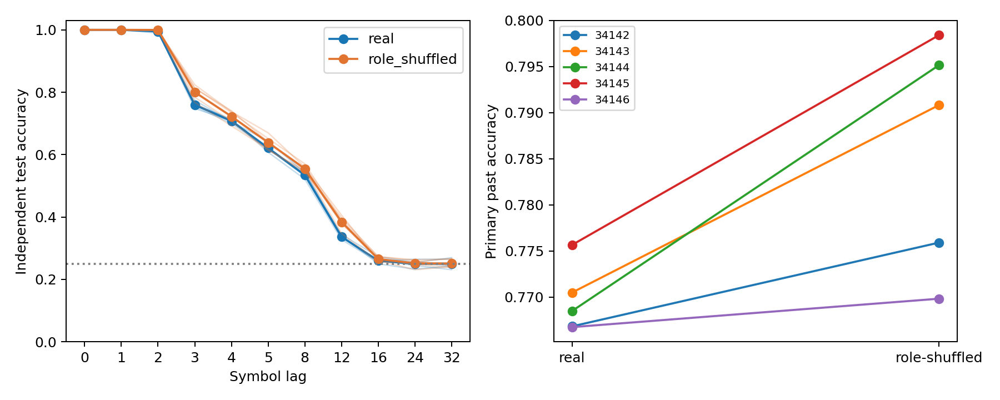

# 현행 K4 구조 대조 — ACT III 결과

**실제 배선의 우위는 확인되지 않았다.** 독립 수열의 과거 기호 해독 정확도는
실제 부분망76.965%, 역할·차수 보존 재배선78.603%였다. 실제−재배선 차이는
−1.638%p이고5개 paired seed 모두 음수였다. 두 조건 모두 과거 기호 접근성
기준은 통과했다. 이번 결과는 자율 회상 점수가 아니다.

사전 protocol commit `c128c05`, 실행 구현 `5d0967f`.
[Protocol](structural-k4-protocol.md) · [Config](../configs/structural_k4.json) ·
[전체 manifest](../results/structural_k4_main/manifest.json).

## 1. Repository audit

기존 README, 연구 상태·방향·로드맵, Phase3/3b, 현재 protocol/config, 재배선·
정규화·시간 갱신·K별 입력·ridge 코드와 테스트, 기존 독립 수열 checkpoint를
교차 확인했다. 최근 기준 commit은cd68d3c였다. 과거 Phase3/3b에는 이미
구조 대조가 있었고 실제 배선의 우위를 입증하지 못했다. 이번 실험이 최초의
구조 대조인 것처럼 표현하지 않는다. 현행 ACT III의 제한된 진입 실험이다.

보존 속성의 범위를 명확히 했다. 원시 그래프의 뉴런별 입·출력 차수, 역할 간
연결 수, 뉴런별 출력 signed weight multiset을 보존한다. 하지만 재배선 뒤
각 그래프를 별도로 incoming-L1 정규화하므로 **정규화된 개별 가중치나 출력
가중치 목록은 보존하지 않는다**. 실제10개 대조에서644–645개 뉴런의 정규화된
출력 가중치 목록이 달라졌다. 순수한 topology 효과로 해석할 수 없다.

기존6,472개 결과 파일과 역사적 수치 코드·protocol의 해시를 보존했다.
`summary.json`의 cell별 통계는 기존 공통 helper의 스키마를 따른다. cell 안의
`paired_dz`는 단순 mean/SD 필드이므로 paired 효과로 사용하지 않는다.
보고하는 paired effect는 `real_minus_shuffled.test_accuracy.paired_dz`뿐이다.

## 2. Reproduced baseline

기존 `delay_main_v2/legacy5_c701_s14142`의 K10 독립 수열 baseline을 재현했다.
학습2,000/평가1,000행, 각100 warmup, gain0.9/leak0.6,48 MBON, ridge alpha1.
저장 수열의 전체 학습·평가 상태 궤적, 표준화·계수·절편과 테스트 score가
모두 정확히 일치했다. 기존 primary 과거 정확도는59.6000%이다.
이번에 새 clean venv를 만든 것은 아니며, ACT I 때 clean하게 구성한 고정
Python3.12.10 환경을 재사용했다. 새 실행 manifest에 실제 패키지·BLAS·장비를 남겼다.

## 3. New implementation

`scripts/structural_k4.py`: 원시 그래프 감사, 동일 K4 입력과48 MBON 관측,
독립 수열 생성, graph별 별도 affine ridge fitting, shifted-target 대조,
상태 진단, 원시/정규화 그래프·checkpoint·manifest 저장을 구현했다.
매 run마다 그래프를 다시 생성하고 두 수열을 다시 실행하며 독립 재학습한다.
별도 augmented least-squares 풀이와 score1e-9/prediction exact 검증도 적용했다.
역사적 numerical module을 변경하지 않았다.

`scripts/verify_structural_k4.py`는 저장 artifact의 label 지연 정렬, 수열 RNG,
예측·손실·정확도·R2·paired 집계·bootstrap·판정 기준을 다시 계산한다.
전체 테스트175 passed,8 optional-dependency skips.

검증기 초기 실패도 보존했다. 최초 문법 오류를 실행 전에 수정했고, 이어
단일 BLAS 스레드 설정 누락으로 최대2.89e−15의 score 차이가 발생했다.
원래 실행과 동일한1 thread를 적용하자 exact 검증이 통과했다. 허용오차나
실험 결과를 바꾸지 않았다. [실패 기록](../results/structural_k4_validation/failure.json),
[최종 검증](../results/structural_k4_validation_v2/checks.json).

## 4. Experiments executed

- Smoke: mapping34001/train35001/test36001/rewire37001, circuit701,
  실제·재배선2회, train200/test100. 본 결과에서 제외.
- Main: mapping34142–34146, train35142–35146, test36142–36146,
  rewire37142–37146. Circuit701/702 각각686 neurons,3,309/3,241 edges,
  threshold5. 실제·재배선20회와20회 exact replay/independent refit.
- 입력은512 KC 중 기호당51개, amplitude0.5. 관측은동일48 MBON.
  gain0.9/leak0.6/incoming-L1/mbon_after_kc. 각 stream 별도 reset.
- K4 iid uniform train2,000/test1,000행에 warmup100씩 추가.
  lag0/1/2/3/4/5/8/12/16/24/32; primary는1/2/3/4/5/8의 평균.
- 지연당48×4+4=196 계수, affine ridge alpha1.0.11 real heads와11
  shifted-null heads/run. 수열 입력 후의 상태를 관측한다. 학습만으로 표준화한다.
- 본 결과20회는새 graph/state 실행이다. 저장 상태 재분석은 별도 신규 sample이
  아니다. Positive 기준 미달로 사전 등록한 확인12회는 실행하지 않았다.

## 5. Results

각 circuit까지 보존한 raw primary 결과:

| mapping seed | circuit | 실제 % | 재배선 % | 실제−재배선 %p |
| --- | --- | --- | --- | --- |
| 34142 | 701 | 75.483 | 76.900 | -1.417 |
| 34142 | 702 | 77.883 | 78.283 | -0.400 |
| 34143 | 701 | 77.350 | 79.300 | -1.950 |
| 34143 | 702 | 76.750 | 78.867 | -2.117 |
| 34144 | 701 | 76.650 | 80.433 | -3.783 |
| 34144 | 702 | 77.050 | 78.600 | -1.550 |
| 34145 | 701 | 77.617 | 80.283 | -2.667 |
| 34145 | 702 | 77.517 | 79.400 | -1.883 |
| 34146 | 701 | 76.700 | 76.517 | +0.183 |
| 34146 | 702 | 76.650 | 77.450 | -0.800 |


통계의 단위는 두 circuit 평균을 낸5개 seed block이다:

| paired seed | 실제 % | 재배선 % | 차이 %p |
| --- | --- | --- | --- |
| 34142 | 76.683 | 77.592 | -0.908 |
| 34143 | 77.050 | 79.083 | -2.033 |
| 34144 | 76.850 | 79.517 | -2.667 |
| 34145 | 77.567 | 79.842 | -2.275 |
| 34146 | 76.675 | 76.983 | -0.308 |


| 통계 | 실제 | 재배선 | paired 차이 |
| --- | --- | --- | --- |
| 평균 (%) / 차이 (%p) | 76.9650 | 78.6033 | -1.6383 |
| 중앙값 (%) / 차이 (%p) | 76.8500 | 79.0833 | -2.0333 |
| 표본 분산 (%p²) | 0.1365 | 1.5615 | 0.9802 |


실제−재배선 bootstrap95% 구간은[-2.383,
-0.822]%p, paired dz=-1.655.
5개 block의 작은 표본이며 CI는 기술 통계로 해석한다. 재배선 우위에 대한
독립 확인을 실행한 것은 아니다. 성공 기준을 반대 방향으로 바꾸지 않는다.

Training-frequency 정확도는 두 조건 25.133%, shifted-null은 실제 22.217% /
재배선 21.925%, R2 대비 frequency는 0.5403/0.5699였다. Shifted null은 유한
수열의 실제 측정치이며 이론적 chance25%로 대체하지 않았다.
현재 기호와 lag1은 두 조건 100%; lag8은 53.45%/55.48%; lag24–32는 약 25%였다.
Circuit701 평균76.760%/78.687%,702 평균77.170%/78.520%로 같은 방향이다.



[전체220개 lag 결과](../results/structural_k4_main/raw-lag-table.csv) ·
[20개 raw primary 결과](../results/structural_k4_main/raw-past-table.csv) ·
[paired 차이](../results/structural_k4_main/paired-differences.csv).

## 6. Interpretation

사전 계획대로 negative 결과 뒤 representation 진단을 수행했다. 추가 학습,
seed 교체, hyperparameter 조정은 하지 않았다.

| 진단 | 실제 | 재배선 |
| --- | --- | --- |
| 중심화 MBON 상태 effective rank | 6.6800989 | 7.2223277 |
| 평균 활동 뉴런 수 | 647 | 646.99995 |
| 평균 MBON 상태 norm | 0.12275984 | 0.10070868 |
| 평균 MBON 표준편차 | 0.0037287752 | 0.0039350109 |
| 연속 상태 cosine | 0.97897331 | 0.96651055 |
| 32단계 무입력 후 MBON norm 비율 | 5.7415052e-07 | 7.6946861e-07 |


재배선망의 관측 상태 다양성(effective rank)이 더 높고 연속 상태 유사도가
더 낮았다. 반면 활동 뉴런 수는 거의 같고, 48 MBON의 epsilon 1e−8 기준 sparsity는
두 조건 모두 0이었다. 활동 뉴런 수가 늘어서 설명되는 차이는 아니다. Rank와 해독
차이의 동반 관측이 rank의 인과적 기여를 증명하지는 않는다.
32단계 무입력 뒤 norm은 두 조건 모두 크게 감쇠했다. 단일 시작 상태의 감쇠 곡선은
전체 memory capacity 또는 입력 정보의 소실을 직접 측정하지 않는다.

10개 재배선 모두5×edge count swap을 완료했다. 원시 edge overlap은
48.53–50.48%. 일부 singleton/constrained 역할
블록이 연결을 유지하므로 충분히 혼합된 균일 random ensemble이라고 부를 수
없다. 역할별 overlap과 strength 변화는 각 graph.json에 기록했다.

## 7. Negative findings

실제 배선 우위H2 실패: 평균+3%p 및4/5 positive 기준에 도달하지 못했다.
반대로 해독 가능성 H1은 실제·재배선 둘 다 통과했다. 따라서 “실제 배선이어야만
과거 입력이 해독된다”는 해석은 지지되지 않는다. 이는Phase3/3b의 기존
부정 결과와 모순되지 않는다. ACT I의 whole-brain 우위 부정 결과도 그대로다.

## 8. What we can claim

실제 초파리 connectome 구조를 사용한 계산 모델과 지정된 재배선 대조모델
모두, 독립 K4 테스트 수열에서 과거 기호 정보를48 MBON 상태로부터 해독할
수 있었다. 이번 설정에서는 실제 배선이 더 좋다는 근거가 없고,
관측 평균은 재배선 쪽이 높았다. 이것은 representation+external decoding 결과다.

## 9. What we cannot claim

자율 회상 개선, whole-brain 우위, 실물 초파리의 기억·학습, 내부 연결의
experience-dependent 학습, 생물학적 memory circuit 식별 또는 formal memory
capacity를 주장할 수 없다. 두 고정 부분망·5개 블록·한 종류 구조 대조의 결과이며,
배선과 정규화된 가중치 변화의 효과를 분리하지 못했다. 더 복잡한 decoder나
다른 동역학에서 동일할 것이라는 결론도 아니다.

## 10. Reproducibility

본 실행 runtime(전체 replay 포함)55.79s,
50ms 간격 sampled peak RSS 164.50MiB.
실제 peak의 상한이나 GPU 측정값은 아니다.20개 checkpoint,20개 raw graph,
20개 normalized graph와 모든 수열·state·score·coefficient를 보존했다.
프로토콜은 결과 전에 고정했고 6,472개 기존 결과의 바이트가 그대로다.

```powershell
$env:PYTHONPATH='src'
.venv/Scripts/python.exe scripts/structural_k4.py --cohort smoke --out outputs/structural_smoke_new
.venv/Scripts/python.exe scripts/structural_k4.py --cohort main --out outputs/structural_main_new
.venv/Scripts/python.exe scripts/verify_structural_k4.py --out outputs/structural_check_new outputs/structural_smoke_new outputs/structural_main_new
```

Python3.12.10과`requirements-act1-lock.txt`로 환경을 구성한다. 기존 결과
manifest는 원래 source revision을 고정하므로 엄격한 역사적 재현은 `5d0967f`의 runner와
기록된 source hash를 사용한다. 최종 revision의 신규 검증기는 일치하는 수치 소스를
재사용한다. 단일 수치 스레드는 runner와 verifier에서 적용한다.
Confirmation 명령은 검증된 main gate가 false이면 거부된다.

## 11. Next highest-information experiment

**동일 재배선 그래프에서 정규화 계수를 고정하는 한 가지 대조.**
같은 원시 재배선망에 대해 현재의 graph별 incoming-L1 계수와 원래 실제망에서 계산한
postsynaptic 계수를 적용한 조건을 paired 비교한다. 독립 수열과 관측·출력층 예산은
동일하게 고정하고 새 protocol을 먼저 작성한다. 이것은 재정규화가 관측 차이에 얼마나
기여하는지를 검사한다. 고정 계수 조건은 행별 L1 bound가 달라질 수 있으므로 동역학
안정성도 사전에 정의해야 하며, 이것만으로 순수 topology 효과가 분리되는 것은 아니다.
현재는 제안이며 아직 실행하지 않았다. ACT IV를 앞당기지 않는다.
