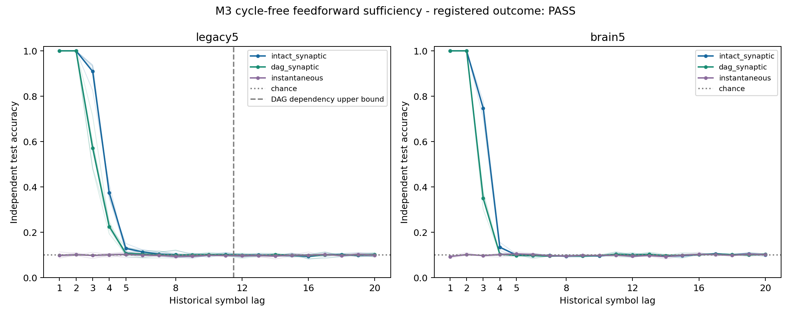

# M3: cycle-free delayed feedforward sufficiency — results and synthesis

Date: 2026-10-08. **Registered primary PASS**, independently verified.
All27 planned cases and validation are complete. This is the finite M3 rate-model
mechanism study; physiology/plasticity P3 was not performed.
[Protocol](temporal-cycles-protocol.md) and
[config](../configs/temporal_cycles.json) were committed as `438cae437` before
neural outcomes. Main source: `a3ff879b00b69f5538210e4cc05e2a07cba54e3e`.
Namespace `results/tdc_cycles_v1/`, baseline `eb571bd`.

## 1. What was asked?

Can a source-derived acyclic graph, with direct state carry disabled, retain
decodable iid past-input information through delayed feedforward transmission?
The next-work cycle question was narrowed prospectively to sufficiency: removing
backward edges changes more than cycles, so the intact−DAG gap cannot isolate
a unique feedback-cycle contribution or establish necessity.

Order KC neurons first, other roles next, MBONs last; use numeric source root
IDs ascending within each tier. Keep only edges whose source rank is below
target rank. This imposed ordering is not a biological hierarchy. Every retained
edge increases rank, so the graph has no directed cycle/self-edge. No neurons
are copied, and the same48 MBON coordinates/readout budget remain.

Original W is gain.9 incoming-L1 normalized before masking; no rescaling follows
deletion. The entire current KC→MBON block and its coefficients remain exact.
All arms use drive.6, direct carry0, `mbon_after_kc`, amplitude.5/fraction.1:
intact_synaptic (original W), dag_synaptic (masked W), instantaneous (no prior-state
drive, current block retained). Intact_synaptic is the zero-carry benchmark,
not M1's full carry-on model. Only external affine alpha1 ridge readouts learn.

| Structural property | Partial legacy5 | Whole brain5 |
| --- | ---: | ---: |
| Nodes | 686 | 138,639 |
| Original edges | 3,309 | 2,700,513 |
| Retained DAG edges | 2,500 | 1,353,524 |
| Protected current KC→MBON edges, all retained | 1,474 | 21,438 |
| DAG cycle/self edges | 0 /0 | 0 /0 |
| Global scheduled dependency upper bound H | 11 | 153 |
| Common-suffix certificate length H+1 | 12 | 154 |
| Mean observed-row incoming weight fraction retained | .772609 | .926680 |

Per-neuron degrees/masses, role flows, ranks, SCCs and dependency depths are
[archived before outcomes](../results/tdc_cycles_v1/structural_audit/checks.json).
Cross-SCC-only was rejected structurally because it removes the protected
input paths. The chosen DAG still changes degrees, total drive and delayed paths;
normalization/source weights are preserved, not degree/strength matching.

Six fresh primary blocks1300001–1300006; secondary firstthree paired blocks.
Mapping1310001–1310006, independent train1320001–1320006 and test1330001–1330006;
uniform iid K10, reset train/test separately, warmup200, train4000/test2000 scored
rows per lag0–20. After input t, decode `state(t)->symbol(t-lag)` with490 affine
ridge coefficients/intercepts per lag, train-only mean/SD floor1e-5. Streams,
input root IDs and observed source IDs are paired across arms/levels. Whole's
three blocks are not three additional independent input replicates.

## 2. What was confirmed?

The fixed primary asks whether DAG lag2 accuracy exceeds the strongest of
chance10%, training-derived class-frequency prediction and current-symbol-only
lookup by **at least10pp in every one of six blocks**. Instantaneous current
accuracy must be>=99%; exact input/prototype/acyclicity/finite-history/replay
checks must pass. All arms' current accuracy is100%, and all validity checks pass.

| Primary block | Correct /2000 | Accuracy (%) | Strongest baseline (%) | Excess (pp) | Registered cell |
| --- | ---: | ---: | ---: | ---: | --- |
| 1300001 | 2000 | 100.00 | 10.00 | 90.00 | PASS |
| 1300002 | 2000 | 100.00 | 11.50 | 88.50 | PASS |
| 1300003 | 2000 | 100.00 | 10.00 | 90.00 | PASS |
| 1300004 | 2000 | 100.00 | 11.05 | 88.95 | PASS |
| 1300005 | 1998 | 99.90 | 11.25 | 88.65 | PASS |
| 1300006 | 2000 | 100.00 | 10.00 | 90.00 | PASS |

Partial total11998/12000 =99.983333% lag2 decoding. Mean excess89.35pp
(`1787/2000` raw fraction), minimum88.5pp (`177/200`), well above the registered
10pp requirement. Median excess89.475pp, sample SD.726636pp; paired descriptive
bootstrap2.5–97.5% interval[88.825,89.825]pp. Accuracy mean/median/sample SD are
99.983333%/100%/.040825pp, bootstrap[99.95,100]%. These intervals describe the
six fixed computational blocks, not animals or biological populations.

Whole secondary firstthree scores6000/6000=100%, all its cells PASS; mean
excess89.5pp, minimum88.5pp, bootstrap[88.5,90]pp. It remains secondary and does
not establish whole-brain superiority. Rational correct-count arithmetic checks
the conjunction and threshold equality; no settings, lags or seeds were changed.
[Exact primary cells](../results/tdc_cycles_v1/main/primary-cells.csv),
[raw metrics](../results/tdc_cycles_v1/main/raw-lags.csv),
[complete summary](../results/tdc_cycles_v1/main/summary.json).

## Complete temporal curves and finite dependency certificates

Mean test accuracy (%) below; other lags are descriptive, not substitute gates.
Frequency/current-only baselines, chance-adjusted accuracy, baseline excess,
means/medians/sample SD and paired10,000-draw intervals (seed1340001) are retained
in [curve summaries](../results/tdc_cycles_v1/main/curve-summary.csv).

| Graph / lag | intact_synaptic | dag_synaptic | instantaneous |
| --- | ---: | ---: | ---: |
| Partial /0 | 100.00 | 100.00 | 100.00 |
| Partial /1 | 100.00 | 100.00 | 9.79 |
| Partial /2 | 100.00 | 99.98 | 10.13 |
| Partial /3 | 90.90 | 57.13 | 9.79 |
| Partial /4 | 37.46 | 22.50 | 10.03 |
| Partial /5 | 12.88 | 10.73 | 10.23 |
| Partial /8 | 10.12 | 10.03 | 9.38 |
| Partial /12 | 9.90 | 9.78 | 9.66 |
| Partial /20 | 10.03 | 10.16 | 9.87 |
| Whole /0 | 100.00 | 100.00 | 100.00 |
| Whole /1 | 100.00 | 100.00 | 9.28 |
| Whole /2 | 100.00 | 100.00 | 10.22 |
| Whole /3 | 74.68 | 34.93 | 9.73 |
| Whole /4 | 13.45 | 10.30 | 10.10 |
| Whole /5 | 9.95 | 9.75 | 10.50 |
| Whole /8 | 9.45 | 9.58 | 9.55 |
| Whole /12 | 10.05 | 10.00 | 9.47 |
| Whole /20 | 10.07 | 10.35 | 10.13 |



Thin lines show every paired block; thick lines show means. Curves are not
forced monotone, scores remain unclipped, and current lag0 is separate. Dashed
partial marker indicates its structural dependency upper bound11. High lag2
decoding does not imply long-lag accuracy or a formal capacity measurement.

KC→MBON edges read current updated KC (delay0); other edges read previous state
(delay1). Strict rank increase makes the weighted dependency graph finite.
H=11/153 is a conservative longest-path bound starting from any initial
coordinate. All-KC input bounds are11/142; whole's actual selected source input
subset can have a smaller bound. Neither is a measured forgetting time. Whole
lag12–20 is inside its bound and is not a counterpart of the partial cutoff.

All9 DAG probes start with two different seeded Gaussian states and64 independent
prefix symbols, then share a12/154-symbol suffix. Prefix-final states differ;
entire terminal state vectors match exactly after the common suffix. The verifier
replays both paths and all18 full-state digests exactly. Topology supplies the
general finite-dependency proof; these finite probes verify implementation.
Warmup200 exceeds both bounds. The instantaneous state equals its current-symbol
prototype at every coordinate/time, independently certifying no history access.

Intact−DAG average lag1–20 accuracy is+2.593750pp partial /+2.149167pp whole.
Intact/DAG raw means are24.620833%/22.027083% partial and22.368333%/20.219167%
whole. [Per-seed scores](../results/tdc_cycles_v1/main/seed-scores.csv) and
[paired differences](../results/tdc_cycles_v1/main/descriptive-differences.csv)
remain descriptive. Deleted degree/weight/path structure prevents attributing
these gaps purely to cycles or applying an unregistered cycle-advantage gate.

## Independent validation and reproducibility

[Independent main checks](../results/tdc_cycles_v1/main_validation/checks.json)
confirm54 exact complete-state trajectory digests,567 independent SVD ridge
refits/predictions,9 instantaneous and27 common zero-state input certificates,
9 finite-history pairs and18 exact certificate path digests. Separate source
graph construction, CSR-row rank masking, incoming topological depth recurrence,
role/degree/mass audits, labels/controls/counts and summary/bootstrap calculations
agree. The verifier does not import main graph/step/fitter/summary functions.

[Main manifest](../results/tdc_cycles_v1/main/manifest.json) SHA256:
`8d5de4917d2fc1fc3aa65e78ca4283ff5d64b6729b9db2cf346487f3739a9939`.
[Source/environment hashes](../results/tdc_cycles_v1/main/source.json),
[registered structure replay](../results/tdc_cycles_v1/main_validation/registered-structure-checks.json),
[raw source rebuild](../results/tdc_cycles_v1/main_validation/source-graph-audit.json),
[11 safeguards](../results/tdc_cycles_v1/guard_tests/checks.json),
[smoke verifier](../results/tdc_cycles_v1/smoke_validation/checks.json),
[final source/history/rational-count audit](../results/tdc_cycles_v1/final_audit/audit.json).

| Completed stage | Wall seconds | Sampled process-tree peak bytes |
| --- | ---: | ---: |
| Smoke | 44.55 | 1,009,504,256 |
| Independent smoke | 63.91 | 1,208,967,168 |
| Main | 358.36 | 1,143,169,024 |
| Independent main | 378.74 | 1,324,875,776 |

All meet the fixed7200-second/4GiB budgets, four workers/one numerical thread.
Tree RSS is50ms sampling of live-process sums, potentially double-counting
shared pages, not exact system peak. Parent lifetime RSS/OS working sets and
per-job records are archived separately (main OS peak179,929,088 bytes,
independent main542,187,520 bytes). Smoke6/12/126 and2 certificate pairs are
technical evidence excluded from the main27/54/567 and9 pairs. No M3 dynamical
execution/validation attempt failed; older failures remain unchanged. An initial
read-only cache inventory request for unavailable/unneeded brain1 is recorded in
the baseline audit; required nodes/brain5/raw sources authenticate correctly.

Use recorded Python3.12.10/NumPy2.3.5/SciPy1.17.0/OpenBLAS0.3.30/Windows11
and pinned source/cache hashes. [P1 preparation](temporal-memory-curve-results.md#reproduction).
From repository root, use new destinations:

```powershell
$env:PYTHONPATH = 'src;scripts'
$env:OPENBLAS_NUM_THREADS = '1'
$env:OMP_NUM_THREADS = '1'
$env:MKL_NUM_THREADS = '1'
python scripts/temporal_cycles.py --smoke --out results/tdc_cycles_v1/replay_smoke
python scripts/verify_temporal_cycles.py results/tdc_cycles_v1/replay_smoke --out results/tdc_cycles_v1/replay_smoke_validation
python scripts/temporal_cycles.py --out results/tdc_cycles_v1/replay_main
python scripts/verify_temporal_cycles.py results/tdc_cycles_v1/replay_main --out results/tdc_cycles_v1/replay_main_validation
python -m pytest -q tests/test_temporal_mechanism.py tests/test_temporal_cycles.py
```

Recorded source/environment is required for strict replay. The final auditor
closes this registered run. Existing output paths are rejected, never overwritten.

## 3. What failed or remains unconfirmed?

M3's registered sufficiency gate and technical validation have no failure.
The cross-SCC-only alternative failed structural input access before any new
neural result. M1 remains assay-invalid and its original endpoint undefined;
P2's real-wiring gates and previous whole-brain/local-learning negatives remain.

This does not demonstrate cycles are irrelevant or quantify their unique
contribution. The DAG loses edges, degree, weight mass and paths. The graph order,
drive/scheduling and external readout are computational choices. Strong delayed
decoding can arise from scheduled propagation through an acyclic structure;
decoding alone does not identify feedback storage or a biological storage site.

## 4. What can now be said about DrosoMem?

The fixed source-derived reservoir's historical-input evidence remains. M3 adds
that an acyclic, zero-direct-carry source subset can support near-perfect iid
lag2 decoding under these scheduled computational dynamics and readout budgets.
Delayed feedforward propagation is sufficient for that bounded result. No
biological learning, physiological dopamine, living-fly pi memory, general
real/whole wiring superiority or formal Shannon/reservoir capacity is established.

[Baseline seal](../results/tdc_cycles_v1/baseline_audit/checks.json) preserves43,495
prior result-file Git identities and old scientific source/data/config/protocol/
tests, including M1 failures and closed M2. Sparse-excluded history is protected
by Git identity, not claimed freshly replayed. M1 stays invalid; M2's specific
joint decoding result and P1/P2 synthesis remain separate and unchanged.

M3's finite execution and verification are closed. Next candidate: establish
whether a cycle-attribution design can adequately match deleted degree, strength
and delayed-path effects while preserving current access. That is a separate
prospective methodological question, unregistered/unexecuted here; do not start
a new seed/order/decoder sweep or P3 automatically.

## 비전공자를 위한 한국어 요약

**질문:** 연결이 되돌아오는 고리 없이, 신호가 앞으로 전달되는 시간차만으로
과거 숫자를 읽을 수 있는지 확인했습니다. 상태가 자기 자신에 남는 항도 껐습니다.

**확인:** 부분망의2단계 전 숫자 정확도는99.98%였고, 여섯 seed 모두 미리 정한
기준을 통과했습니다. 현재 숫자도100% 읽었습니다. 서로 다른 과거를 준 뒤
같은 입력을 충분히 주면 전체 상태가 같아지는 수학적 성질과 실제 재계산도
일치했습니다.

**실패·한계:** 이번 기준과 검증에는 실패가 없었습니다. 고리를 없애면서 다른
연결도 줄였기 때문에 원래 망과의 차이를 고리만의 효과라고 말할 수 없습니다.
앞선 실패 결과도 그대로 유지했습니다.

**현재 결론:** 계산 모델에서는 신호 전달의 시간차만으로도 과거 입력의 흔적이
읽힐 수 있습니다. 실제 초파리의 기억 위치나 생물학적 학습을 밝혔다는 뜻은 아닙니다.
