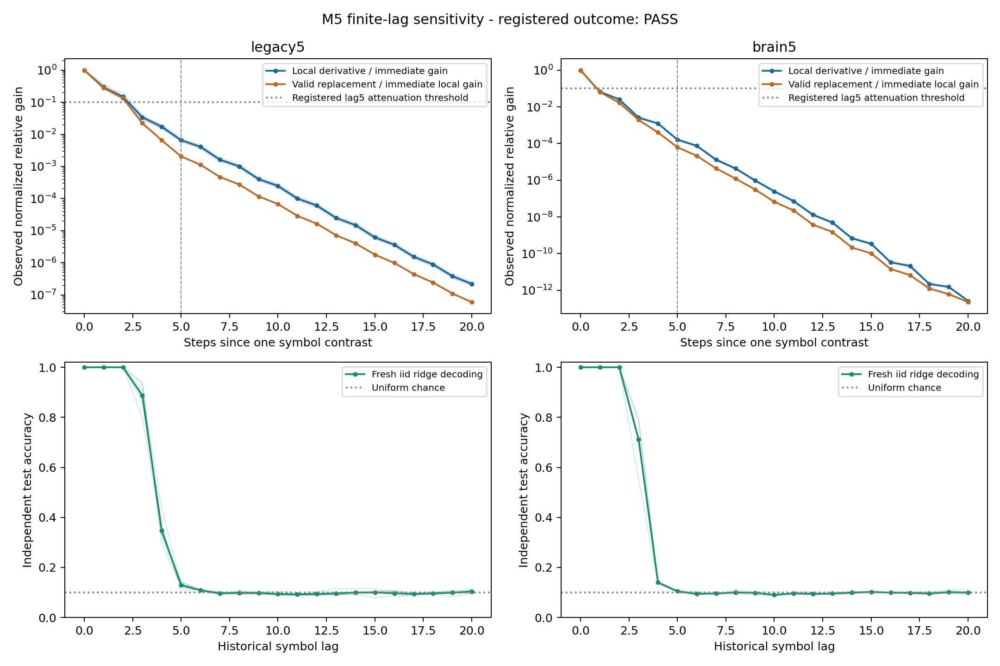

# M5: finite-lag functional symbol-contrast sensitivity — results and synthesis

Date: 2026-10-08. **Registered attenuation hypothesis PASS**, with independent
main validation complete. All9 fixed cases are closed; no further seed, lag,
epsilon, decoder or coefficient search follows this result.
[Protocol](temporal-functional-sensitivity-protocol.md),
[config](../configs/temporal_functional_sensitivity.json).

## 1. What was asked?

How quickly does the actual signed/nonlinear effect of one past input contrast
on observed model state diminish, and how does that differ from structural
reachability, a finite valid symbol replacement and iid decoding?

M4 found limits on exact cycle controls, not the magnitude of useful influence.
M5 keeps the original graph fixed and measures its response. Baseline main
`4a72db553f80317c282f48561e33b5edbfc3a765`; namespace
`results/functional_sensitivity_v1/`. Protocol/config committed as
`37212abeb6cfc1a4907e08348ff41030f3edfb8b` before new source outcomes. Main and
independent verification source: `c541993484f6778a031d71ad4eb1798c748f6ce7`.

Use circuit701 legacy5 primary and brain5 secondary: original gain0.9
incoming-L1 signed weights, zero direct carry, drive0.6, mbon_after_kc.
These are M3 intact_synaptic semantics, not the carry-on v1/full model.
No graph mask/rewiring or recurrent learning. Six fixed blocks1500001–1500006,
mapping1510001–1510006, independent iid K10 train1520001–1520006 and
test1530001–1530006; whole firstthree are paired counterparts, not additional
independent input replicates. Each symbol stimulates51 of the same512 KC input
neurons; same48 observed MBON IDs. Reset train/test separately, warmup200,
train4000/test2000 scored rows; alpha1 ridge,490 affine parameters per lag0–20,
train-only mean/SD floor1e-5. Only the external decoder learns.

At32 fixed test anchors per case, replace input at ONE step by
`p_s+eta*(p_(s+1)%10-p_s)` and keep the exact pre-state and all future inputs
unchanged. Derivative at eta0 is a local sensitivity of a synthetic continuous
encoder extension. Negative eta and imaginary pulses are numerical controls,
not physiological inputs or derivatives of categorical variables. Eta1 is an
actual valid symbol replacement. Cyclic label adjacency has no intrinsic
biological meaning; these are selected directions, not all90 ordered contrasts.
The anchors are not class-balanced or independent models/animals.

Normalize each observed derivative by its input-contrast L2 norm, then pool
32 squared gains: `G_l=sqrt(mean(g_probe,l^2))`, `R_l=G_l/G_0`.
Primary asks `R_5<=0.10` in **every six primary blocks**, with G0>=1e-8
normalization eligibility and technical checks passed. Official decisions use
exact saved-float rational squares `S_5<=S_0/100`; equality passes and no
numerical tolerance enlarges the scientific threshold. This is an operational
amplitude attenuation criterion, not a percentage of memory lost.

## 2. What was confirmed?

All primary cells satisfy the registered criterion, and all technical checks
pass. Whole firstthree secondary separately passes the same fixed rule.

| Primary block | Immediate normalized gain G0 | Lag5 / immediate local gain (%) | Registered cell |
| --- | ---: | ---: | --- |
| 1500001 | .00856006 | .65847 | PASS |
| 1500002 | .00800901 | .66615 | PASS |
| 1500003 | .00888794 | .58138 | PASS |
| 1500004 | .00735265 | .69397 | PASS |
| 1500005 | .00673013 | .76699 | PASS |
| 1500006 | .00863773 | .60111 | PASS |

Primary mean R5=.0066134556, or **0.6613456% of immediate observed derivative
gain**. Median0.6623087%, sample SD0.0667512 percentage points; descriptive
10,000-draw block bootstrap[0.6149348,0.7103675]%. Maximum block0.7669912%
is below the registered10% limit. These summaries describe six fixed
computational blocks; they are not biological population confidence intervals.

Whole mean R5=.0001634659, or0.0163466%; its three values are
0.0185642%,0.0160915%,0.0143842%, all below10%. Current gains range
.00154064–.00178508, compared with partial .00673013–.00888794. Both exceed the
fixed1e-8 eligibility floor. Cross-graph gains/amplitudes are not assumed equal;
these differences do not establish whole-brain memory superiority/inferiority.
[Exact primary cells](../results/functional_sensitivity_v1/main/primary-cells.json),
[summary/bootstrap](../results/functional_sensitivity_v1/main/summary.json).

### Reachable paths, local response and decoding are different measurements

| Graph / lag | Mean local relative gain R (%) | Mean iid decoding (%) |
| --- | ---: | ---: |
| Partial /0 | 100.000 | 100.000 |
| Partial /1 | 29.5111 | 100.000 |
| Partial /2 | 14.8422 | 100.000 |
| Partial /3 | 3.39628 | 88.7667 |
| Partial /4 | 1.73368 | 34.7583 |
| Partial /5 | .661346 | 12.9917 |
| Partial /8 | .100934 | 9.8583 |
| Whole /0 | 100.000 | 100.000 |
| Whole /1 | 6.68843 | 100.000 |
| Whole /2 | 2.53558 | 100.000 |
| Whole /3 | .257375 | 71.1167 |
| Whole /4 | .123981 | 13.9833 |
| Whole /5 | .0163466 | 10.4667 |
| Whole /8 | .000440531 | 10.0167 |

Current R0=1 is normalization, not an accuracy result. Fresh TDC is descriptive
context with no second confirmatory gate. Lag2 scores12000/12000 partial and
6000/6000 whole while local response is already attenuated. Thus gain magnitude
and linear decoding cannot be identified. Lag5 excess above the strongest
registered-style frequency/current/chance baseline is descriptively+2.5083pp
partial and−.3167pp whole; no new memory-benefit criterion is applied.

For all sampled contrasts, boolean observed-coordinate support becomes complete
at partial lag3/whole lag2 and remains complete through lag20, while gain
shrinks sharply. This is structural existence, ignoring signed cancellation,
amplitude, nonlinear effects and readout access. It does not establish useful
long-term influence. [Raw decoding](../results/functional_sensitivity_v1/main/raw-lags.csv),
[raw probe responses](../results/functional_sensitivity_v1/main/raw-sensitivity.csv),
[per-block curves](../results/functional_sensitivity_v1/main/block-sensitivity.csv),
[curve summaries](../results/functional_sensitivity_v1/main/sensitivity-summary.csv).

Thin lines show blocks; thick lines show means. Top axes are logarithmic with
different vertical ranges; compare tick values. Both top curves use immediate
LOCAL derivative gain as denominator, including the valid replacement curve.
Only lag5/local gain has the registered10% criterion. Bottom axes show
independent test accuracy; curves are not forced monotone or clipped to chance.
Late computed derivative values below finite-difference resolution do not
establish resolved nonzero long-term influence.

### Finite valid replacement is not the local tangent

The32 eta1 replacements per case change exactly one actual symbol and preserve
future iid inputs. At lag5, the mean per-block finite-replacement/local-tangent
gain ratio is .313082 partial / .388230 whole. Near current input the ratios
are .997128 / .990415. Nonlinearity and path/direction cancellation matter over
time: a local interpolation derivative does not exactly quantify a full
categorical replacement. This difference is descriptive, not a new endpoint
or unique inhibitory/cycle mechanism.

An unsigned envelope, computed with absolute weights but original unperturbed
derivative factors, bounds every full-state signed tangent. It is a magnitude
bound, not a separately simulated biological circuit. The zero-carry scheduled
map's global infinity contraction bound is0.54, giving
`||v_l||_infinity<=0.3*0.54^l` for the fixed contrasts; eta1 differences obey
the same upper bound. All probes satisfy it. This applies to this stipulated
model, not carry-on DrosoMem models, living flies or calibrated time constants.
It does not guarantee monotone observed ratios after hidden-state projection.

The instantaneous reference keeps current KC→MBON access while disabling prior
drive. Its analytic prototypes and actual replay have exactly zero derivative
and finite replacement influence after lag0 at all coordinates. Immediate
responses need not equal history-bearing responses or cross-graph amplitudes.

## 3. What failed or remains unanswered?

No M5 execution, technical validation or registered attenuation gate failed.
No seed/threshold/epsilon/decoder/lag/budget was adjusted after outcomes.
No claim of improved memory, complete information loss at lag5, formal capacity,
unique cycle causality, anatomical storage or physiological learning is
established. Near-chance descriptive late-lag decoding is not a separately
registered negative inference about all memory tasks.

Finite differences use1e-4 and1e-5 at four fixed anchors; absolute2e-9 tolerance
is per FULL-state coordinate **before input normalization**, with relative2e-5.
The complex-step comparison uses1e-20 and atol1e-12/rtol1e-9. At tiny late
derivatives absolute tolerances dominate. In particular the long whole-brain
tail cannot be advertised as experimentally resolved nonzero memory from these
numbers alone. This is numerical model sensitivity, not biological measurement.

M1 remains assay-invalid with its original endpoint undefined. P2's material
real-wiring gates, M4's strict-control INFEASIBLE and earlier whole-brain and
local-learning negatives remain unchanged; M5 does not repair or relabel them.

## Independent verification, resources and preservation

[Main verifier](../results/functional_sensitivity_v1/main_validation/checks.json)
reconstructs pinned partial CSV and whole parquet/annotation sources, graph
normalization/mappings,18 exact complete baseline state digests and189 SVD
ridge refits/labels/predictions. Its own complex-compatible scheduled dynamics
imports no main Jacobian, reservoir class, decoder or scientific summary.

All288 probe windows/6048 observed complex vectors match;36 selected full-state
probes match across all21 lags. Both epsilon values pass1512 full-coordinate
probe/epsilon/lag checks. The144 centered-FD trajectory digests and1152 digests
across unperturbed/replacement/instantaneous probe paths replay exactly.
These are execution counts within the nine cases, not independent models or
biological replicates. Envelope, structural support, global bounds, instant
control and exact primary criterion agree. No tolerance changes the scientific
threshold. Smoke's registered endpoints remain null (stage label `smoke`).

| Stage | Wall seconds | Sampled aggregate process-tree RSS bytes |
| --- | ---: | ---: |
| Baseline seal | 7.998 | Single-process OS peak67,952,640 |
| Frozen31 synthetic safeguards | 22.469 | Single-process OS peak123,711,488 |
| Smoke | 148.974 | 1,018,535,936 |
| Independent smoke | 221.794 | 1,243,471,872 |
| Main | 276.166 | 2,559,094,784 |
| Independent main | 390.094 | 2,670,751,744 |

Four workers, one numerical thread each; unchanged7200s/4GiB aggregate budget.
50ms sampled tree RSS can double-count shared pages and includes metadata
subprocesses; it is not an exact system-wide peak. Individual process and tree
measurements are both archived. Graphs/data/config/seeds/environment/source
commit, raw arrays/metrics, selected full-vector archives and manifests are kept.
All individual archives are below100MB; no dense N×N Jacobian is allocated.

Main manifest SHA256:
`98eb3b4c3c49934365caa30608fd50b677dd883b7e3ed722271db4aceeaf73af`.
[Manifest](../results/functional_sensitivity_v1/main/manifest.json),
[source/environment](../results/functional_sensitivity_v1/main/source.json),
[runner](../scripts/temporal_functional_sensitivity.py),
[independent verifier](../scripts/verify_temporal_functional_sensitivity.py),
[final artifact audit](../results/functional_sensitivity_v1/final_audit/audit.json).
Source capture authenticates every tracked SHA against its recorded Git blob,
checks clean tree/stable HEAD before/after capture and rechecks bytes before
sealing. All source edits stopped before the31 safeguards and source runs.

The baseline seal preserves44,147 prior result Git identities and44,784 old
paths excluding the four authorized overview documents. Fresh byte checks
cover4,539 materialized results;39,608 sparse-excluded results are identity
protected without claiming a replay. M4's preserved provenance-invalid guard
snapshot/registry remains unchanged. [Baseline audit](../results/functional_sensitivity_v1/baseline_audit/audit.json).

## 4. What can now be said about DrosoMem?

In this fixed source-derived zero-carry computational reservoir, an operational
observed symbol-contrast response attenuates by more than the registered factor
by lag5, even while structural paths remain available. Independent iid past
decoding is perfect at lag2 in these fresh blocks. Small response magnitude,
decodability and structural reachability are distinct findings. The existing
claim that fixed connectome-derived reservoirs retain decodable past-input
information remains supported; no biological or capacity claim is added.

One next candidate is **counterfactual past-symbol tracking by frozen readouts**:
on new independent held-out streams, change one actual past symbol while keeping
future inputs fixed, and test whether the already-trained lag decoder follows
that replacement. Register one fixed lag/criterion, fresh streams, model/head
budget and validity controls before outcomes. This proposal is not registered
or executed, and does not identify a biological storage site or unique cycle
effect. P3 physiology/spiking/plasticity remains outside this programme.

## 비전공자를 위한 한국어 요약

같은 계산 모델에서 과거 입력을 조금 바꿨을 때 남는 반응과, 과거 숫자를
읽어내는 정확도를 따로 측정했습니다. 다섯 단계 뒤의 관측 반응은 부분망에서
즉시 반응의 평균 약0.66%로 줄었고, 사전에 정한 감쇠 기준을 모두 통과했습니다.
하지만 두 단계 전 숫자는 새 독립 입력에서도100% 읽어냈습니다.

즉 흔적의 크기가 줄어드는 것과 정보를 읽을 수 없게 되는 것은 다릅니다.
신호가 지나갈 연결 경로가 많다는 것도 큰 기억 효과를 보장하지 않습니다.
이번에는 살아 있는 초파리의 기억이나 학습을 검증하지 않았으며, 기존의
실패 결과는 그대로 보존했습니다. 다음 후보는 과거 숫자를 실제로 하나
바꿨을 때 고정 출력층의 답도 그 숫자를 따라 바뀌는지 확인하는 연구입니다.
