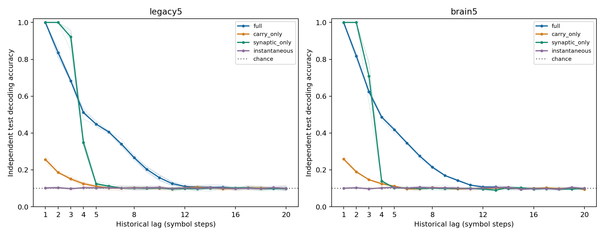

# M1: state carry and history-dependent synaptic drive — results and synthesis

Date: 2026-10-08. **Registered outcome: `assay-invalid`; primary endpoint is
undefined (`null`), not PASS and not an eligible negative mechanism test.**
All planned execution and independent verification are complete. The prospective
input-access requirement failed; the criterion and scientific settings remain
unchanged. The observed contrasts below do not replace that requirement.

[Protocol](temporal-mechanism-protocol.md), committed as `6c6c296` before new
arm outcomes; [config](../configs/temporal_mechanism.json).
Main numerical source: `4c2619df99a87c4072ecc8bd7481c67932963ab2`.
Independent verifier after documented memory repair: `2c3d096`.
New namespace: `results/tdc_mechanism_v1/`.

## 1. What question was asked?

Does history-dependent synaptic transmission add materially to historical iid
input decoding beyond direct state persistence, while retaining current input
access and equal readout budgets? This is a computational mechanism question,
separate from the closed real-versus-rewired P2 question.

The fixed model has drive coefficient `b=.6` and direct carry coefficient
`1-b=.4`. A four-arm intervention switches the carry term and synapses reading
the previous state independently. Every arm retains the same normalized weights,
input encoder and same-step KC-to-MBON transmission. Turning off carry does not
change b to1. At zero state, all arms respond identically to each current symbol.

| Arm | Direct carry | Previous-state synaptic drive | Interpretation |
| --- | --- | --- | --- |
| full | on | on | Unmodified validated `TimedReservoir` |
| carry_only | on | off | Leaky cascade with current KC-to-MBON transmission |
| synaptic_only | off | on | Delayed synaptic transmission without direct self carry |
| instantaneous | off | off | Current-symbol feedforward response, no history |

Previous-state synaptic drive includes delayed feedforward paths as well as
anatomical feedback cycles. It does not isolate graph-theoretic cycles. Carry
also propagates through the retained current path; it is not isolated-cell
storage. Complete equations and intervention boundaries are in the protocol.

Primary `legacy5`: circuit701, 686 neurons/3,309 source edges, six new fixed
mapping/data blocks1100001–1100006. Secondary `brain5`: 138,639 neurons/
2,700,513 edges, the first three blocks. Every block uses paired independent
uniform iid K10 train/test streams; warmup200, train4,000/test2,000 rows,
lag0–20. Inputs are incorporated before `state(t) -> symbol(t-lag)` decoding.
Every arm/level uses the same48 source MBONs, input root IDs, stream bytes and
490-parameter alpha1 affine ridge per lag. Only external readouts are fitted.

TDC retains its operational definition: test historical decoding accuracy
against lag, not formal Shannon or reservoir memory capacity. Chance is10%;
train-only class-frequency and current-symbol-only baselines are saved at every
lag. There is no autonomous feedback or trained-sequence prediction endpoint.

## 2. What was verified, and what was observed?

The independent verifier rebuilt source graphs/roles/inputs, both state
trajectories, lag labels, train-only normalization, all ridge fits using augmented
least squares, baselines, predictions and all summaries. All72 complete state
trajectory hashes match exactly, including unobserved coordinates. All756 lag
heads and predictions are independently checked. The nine instantaneous cases
match analytical current-symbol prototypes at every state coordinate and time;
all36 cases preserve the common zero-state input response.

[Main verification](../results/tdc_mechanism_v1/main_validation_retry1/checks.json),
[source graph reconstruction](../results/tdc_mechanism_v1/main_validation_retry1/source-graph-audit.json),
[raw metrics](../results/tdc_mechanism_v1/main/raw-lags.csv),
[curve means/medians/SD/intervals](../results/tdc_mechanism_v1/main/curve-summary.csv).

These are descriptive observed mean accuracies (%); they are not confirmation
of the registered material-mechanism endpoint:

| Graph / lag | full | carry_only | synaptic_only | instantaneous |
| --- | ---: | ---: | ---: | ---: |
| Partial / 0 | 100.00 | 84.93 | 100.00 | 100.00 |
| Partial / 1 | 99.95 | 25.64 | 100.00 | 10.19 |
| Partial / 2 | 83.62 | 18.61 | 100.00 | 10.34 |
| Partial / 3 | 68.34 | 15.13 | 92.12 | 9.78 |
| Partial / 4 | 51.11 | 12.43 | 34.84 | 10.31 |
| Partial / 5 | 44.87 | 11.13 | 12.49 | 10.21 |
| Partial / 8 | 26.66 | 10.29 | 10.11 | 10.18 |
| Partial / 12 | 11.04 | 10.25 | 9.82 | 10.25 |
| Partial / 16 | 9.98 | 9.85 | 10.20 | 9.78 |
| Partial / 20 | 9.88 | 9.92 | 9.89 | 10.02 |
| Whole / 0 | 100.00 | 84.72 | 100.00 | 100.00 |
| Whole / 1 | 99.98 | 25.93 | 100.00 | 10.05 |
| Whole / 2 | 81.77 | 18.95 | 100.00 | 10.28 |
| Whole / 3 | 62.43 | 14.67 | 70.85 | 9.75 |
| Whole / 4 | 48.67 | 12.47 | 13.98 | 10.22 |
| Whole / 5 | 41.80 | 11.17 | 10.18 | 10.47 |
| Whole / 8 | 21.48 | 10.47 | 10.02 | 10.27 |
| Whole / 12 | 10.73 | 9.95 | 9.58 | 10.22 |
| Whole / 16 | 9.93 | 9.98 | 9.58 | 9.83 |
| Whole / 20 | 9.87 | 9.40 | 9.95 | 9.95 |



Thin curves are all paired blocks; thick curves are their means. Curves need not
decrease monotonically. Current-symbol lag0 is separate from the historical
curve. Short-lag synaptic-only decoding shows that direct self carry is not
required for these observed short-lag accuracies under this update schedule;
it does not identify feedback cycles or a biological storage site.

The fixed scalar S averages `(accuracy-.1)/.9` equally over lag1–20, without
clipping. The registered primary contrast is full−carry_only: mean at least.03
and positive in all six blocks, conditional on assay eligibility.

| Graph | Arm | Mean S | Lag1–20 mean accuracy (%) |
| --- | --- | ---: | ---: |
| Partial | full | .216995 | 29.5296 |
| Partial | carry_only | .019046 | 11.7142 |
| Partial | synaptic_only | .161361 | 24.5225 |
| Partial | instantaneous | .001593 | 10.1433 |
| Whole | full | .195176 | 27.5658 |
| Whole | carry_only | .017731 | 11.5958 |
| Whole | synaptic_only | .134778 | 22.1300 |
| Whole | instantaneous | .001222 | 10.1100 |

All contrasts and intervals are descriptive because both cohorts fail the
input-access requirement. Bootstrap bounds resample paired computational
blocks10,000 times with fixed seed1140001; they are not animal confidence bounds.

| Graph / contrast | Mean ΔS | Median | Sample SD | Bootstrap 2.5–97.5% | Raw mean Δ (pp) | Registered status |
| --- | ---: | ---: | ---: | --- | ---: | --- |
| Partial full−carry_only | .197949 | .198236 | .005644 | [.193718, .202005] | +17.8154 | undefined |
| Partial full−synaptic_only | .055634 | .054250 | .004043 | [.053398, .058958] | +5.0071 | undefined |
| Partial carry_only−instantaneous | .017454 | .017500 | .003291 | [.015093, .019819] | +1.5708 | undefined |
| Partial synaptic_only−instantaneous | .159769 | .160750 | .003155 | [.157343, .161898] | +14.3792 | undefined |
| Whole full−carry_only | .177444 | .177889 | .001846 | [.175417, .179028] | +15.9700 | undefined |
| Whole full−synaptic_only | .060398 | .057333 | .008048 | [.054333, .069528] | +5.4358 | undefined |
| Whole carry_only−instantaneous | .016509 | .018278 | .003406 | [.012583, .018667] | +1.4858 | undefined |
| Whole synaptic_only−instantaneous | .133556 | .137278 | .007833 | [.124556, .138833] | +12.0200 | undefined |

Primary paired ΔS values, in registered seed order: .202000, .205361,
.189778, .199972, .194083, .196500. Whole secondary values: .179028,
.177889, .175417. See [exact fractions](../results/tdc_mechanism_v1/main/paired-contrasts.csv),
[arm seed scores](../results/tdc_mechanism_v1/main/seed-scores.csv) and
[summary](../results/tdc_mechanism_v1/main/summary.json).
Although the primary observed contrast is large and positive in every block,
that cannot turn an ineligible assay into a registered PASS.

Descriptive interaction `full-carry_only-synaptic_only+instantaneous` is
.038181 partial (3.4363 pp raw) and .043889 whole (3.9500 pp).
Nonlinear dynamics and refitting prevent interpreting it as a fraction of
stored memory or a unique biological mechanism.

## 3. What failed?

The prospective eligibility rule requires lag0 accuracy >=90% in every
primary arm/block. All six partial carry_only blocks fail: 84.55,84.05,85.65,
84.80,84.90,85.60%. Secondary carry_only also fails: 84.50,84.05,85.60%.
Every other arm has100% lag0 accuracy. Identical zero-state input responses
therefore do not establish adequate current decoding during ongoing histories.
Carry_only still contains substantial current information; its eligibility
failure does not mean input access is absent or no memory exists.

The endpoint is **undefined**. Neither the primary nor any secondary contrast
receives a scientific PASS/FAIL result. We do not lower90%, fit another decoder,
choose favorable lags, alter carry/drive, or add seeds after this result.
The scientific question remains unresolved under the registered assay, even
though implementation, execution and verification are complete.

Two technical failures are also retained. The initial synthetic test fixture
divided by a zero incoming-strength row; its NaN failure and byte-exact original
fixture are [archived](../results/tdc_mechanism_v1/test_attempt1/failure.json),
[with source recovery](../results/tdc_mechanism_v1/test_attempt1_source_recovery/checks.json).
Pinned graph normalization was already safe; no model setting changed.

The first main independent validation exceeded its fixed4GiB process-tree
budget. An observation check indexed4200 time rows across138,639 neurons
before selecting48 MBONs, implying a4,658,270,400-byte float64 temporary.
Selecting coordinates first checks the same exact values with a1,612,800-byte
selected array. The [failed attempt and partial checks](../results/tdc_mechanism_v1/main_validation/manifest.json)
remain immutable. Its exact aggregate peak was not persisted by the original
shared pool; we do not invent it. The [repair record](../results/tdc_mechanism_v1/validation_memory_repair/repair.json)
contains original/new verifier hashes and unchanged main-manifest hash.
Smoke was independently reverified before the full retry. Original recorded
source is authenticated at its original Git revision; the repaired verifier's
revision/hash are recorded separately. All other source/data/config/protocol
hashes, numerical tolerances, four workers and4GiB limits are unchanged.

## Reproducibility, resources and closure

[Main manifest](../results/tdc_mechanism_v1/main/manifest.json) SHA256:
`96b4f5afe156daa9b025c980c60586ec6fa637df8aaa6e5443c45a1a50e89bfc`.
[Source/config/environment hashes](../results/tdc_mechanism_v1/main/source.json),
[runner](../scripts/temporal_mechanism.py),
[independent verifier](../scripts/verify_temporal_mechanism.py),
[five final safeguards](../results/tdc_mechanism_v1/final_guard_tests/checks.json),
[final provenance/history audit](../results/tdc_mechanism_v1/final_audit/audit.json).

| Completed stage | Wall seconds | Sampled process-tree peak bytes |
| --- | ---: | ---: |
| Smoke | 33.70 | 1,136,427,008 |
| Original smoke validation | 26.98 | 1,544,421,376 |
| Repaired smoke validation | 22.66 | 1,123,000,320 |
| Main | 383.12 | 987,414,528 |
| Repaired main validation | 432.93 | 1,037,541,376 |

Tree sampling is50ms and sums live RSS, possibly counting shared pages more
than once. It covers the worker pool; separate parent lifetime RSS/Windows
working-set and per-job records are archived. These are measured process
figures, not exact system-wide peak memory. All completed stages meet the
registered two-hour/4GiB limits. Failed validation took163.49 seconds and remains
a resource failure. Main has36 cases/72 streams/756 heads; smoke has8/16/168.
Reverification counts do not mean additional scientific seeds or replicates.

Environment: Python3.12.10, Windows11, NumPy2.3.5, SciPy1.17.0,
OpenBLAS0.3.30, one numerical thread per process. Prepare pinned raw sources
and read-only cache as in [P1 reproduction](temporal-memory-curve-results.md#reproduction).
Use the recorded package versions and fresh output names:

```powershell
$env:PYTHONPATH = 'src;scripts'
$env:OPENBLAS_NUM_THREADS = '1'
$env:OMP_NUM_THREADS = '1'
$env:MKL_NUM_THREADS = '1'
python scripts/temporal_mechanism.py --smoke --out results/tdc_mechanism_v1/replay_smoke
python scripts/verify_temporal_mechanism.py results/tdc_mechanism_v1/replay_smoke --out results/tdc_mechanism_v1/replay_smoke_validation
python scripts/temporal_mechanism.py --out results/tdc_mechanism_v1/replay_main
python scripts/verify_temporal_mechanism.py results/tdc_mechanism_v1/replay_main --out results/tdc_mechanism_v1/replay_main_validation
python -m pytest -q tests/test_temporal_mechanism.py
```

Every run rejects existing destinations. Strict historical replay uses its
recorded revision/environment; the current independent verifier has the
documented technical indexing repair. The final auditor closes this actual
registered run, not arbitrary future replay directories.

## 4. What can now be said about DrosoMem?

The supported core claim remains: **a fixed computational reservoir built from
source-derived Drosophila connectome structure retains decodable information
about past inputs across time.** The closed [P1/P2 synthesis](temporal-memory-synthesis.md)
and all earlier negative results remain unchanged. This study adds validated
intervention trajectories, a no-history reference, and descriptive evidence
about carry/previous-state transmission. It does not deliver registered
confirmation of a material synaptic increment because assay eligibility failed.

All42,015 pre-M1 result Git blobs and prior numerical source/data/config/scripts
are preserved at baseline `28248fc7`. This is a Git-identity preservation claim,
not a fresh replay of every sparsely checked-out historical experiment.
P2 partial real remains below all20 nulls; whole secondary remains +0.985 pp
above the null mean but below its2.7 pp criterion. No real-wiring or whole-brain
advantage is established here. No physiological learning, storage-site,
living-fly pi memory or formal capacity claim. P3 remains outside this study.

This scope is closed. A distinct future protocol could study the joint
current/history decoding tradeoff of these interventions and validate an assay
for its own stated question. Another separate question would isolate delayed
feedforward transmission from feedback cycles. Neither is registered or
executed here; neither is a continuation that changes M1's outcome.

## 비전공자를 위한 한국어 요약

**질문:** 과거 입력의 흔적이 단순히 각 상태에 남는 것인지, 이전 상태를
연결을 통해 전달하는 과정이 추가로 중요한지 비교했습니다. 같은 무작위
입력을 네 조건에 주고, 과거의 숫자를 얼마나 읽어낼 수 있는지 측정했습니다.

**확인한 것:** 실험과 별도 재계산은 서로 일치했습니다. 전체 모델은 상태의
잔존만 남긴 조건보다 과거 숫자를 더 잘 읽어냈습니다. 과거를 쓰지 않는
비교 조건은 현재 숫자는 정확히 읽지만 과거 숫자는 대략 우연 수준이었습니다.
이 차이는 관측 사실로 보존합니다.

**실패한 것:** 공정한 비교를 위해 모든 조건이 현재 숫자를90% 이상 읽도록
사전에 정했습니다. 상태 잔존만 남긴 조건은 약84–86%였으므로 이 요건에
실패했습니다. 따라서 큰 과거 정확도 차이가 있어도 이번 가설을 성공이라고
판정하지 않습니다. 기준을 낮추거나 실험 설정을 바꾸지 않았습니다.

**현재 말할 수 있는 범위:** 초파리 연결 구조를 이용한 고정 계산 모델에
과거 입력을 읽을 수 있는 흔적이 남는다는 기존 결론은 유지됩니다. 이번
비교만으로 연결의 추가 기여를 정식 확정하거나, 실제 초파리의 기억 위치와
학습 원리를 밝혔다는 결론은 내릴 수 없습니다.
