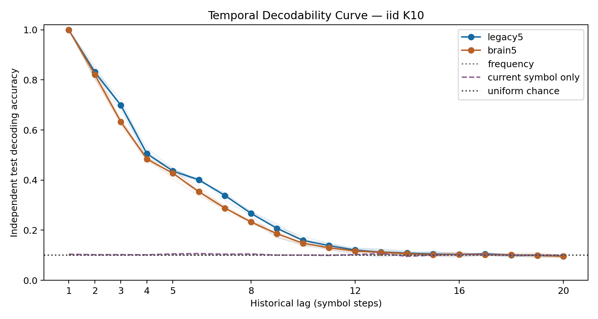

# P1: Temporal Decodability Curve — results

**The registered historical-decoding criterion passes.** All six predetermined
computational blocks on `legacy5` exceed the strongest chance/frequency/current-
symbol baseline by at least 10 percentage points at each of lag1–5. This is
30 required cells, not selection of the best seed or a later success threshold.
The result supports past-input access in a fixed computational reservoir.

## Question, design and registration

[Protocol](temporal-memory-curve-protocol.md) and
[config](../configs/temporal_memory_curve.json) were committed as `981441f`
before new trajectories. Implementation and independent verifier were committed
as `99d9038`. Smoke and its full verification precede main. Main source commit
is `03c12e9e383738161f9bb468e45143c5b3670d83`.

Independent uniform iid K10 train/test streams start from zero state, with
warmup200, train4,000/test2,000 rows at every lag. Six new mapping/data blocks,
one fixed source-derived partial graph and its whole-brain secondary analysis;
48 observed MBON coordinates and 490 affine decoder parameters per lag.
Train-only standardization and alpha-1 ridge, no recurrent learning, no
autonomous feedback. State after input t decodes input t−lag. Lag0 is separate
current-symbol sanity; the operational TDC uses historical lags1–20.

## Curve and baselines

Values are means across the six computational blocks, in percent. Chance is
10%; the two fitted baselines stay close to chance at historical lags. Baseline
excess below averages the per-block maximum of chance, frequency and current-
symbol-only accuracy, rather than taking the maximum of their averaged values.

| lag | partial accuracy | whole-brain accuracy | partial baseline excess (pp) |
| ---: | ---: | ---: | ---: |
| 1 | 99.96 | 99.98 | 89.28 |
| 2 | 83.11 | 82.18 | 72.73 |
| 3 | 69.93 | 63.25 | 59.54 |
| 4 | 50.53 | 48.43 | 40.08 |
| 5 | 43.60 | 42.72 | 32.74 |
| 8 | 26.73 | 23.28 | 16.07 |
| 12 | 12.06 | 11.64 | 1.62 |
| 16 | 10.29 | 10.37 | −0.37 |
| 20 | 9.62 | 9.53 | −0.72 |



Lag0 accuracy is 100% in both graphs and its current-symbol baseline is also
100%. It is not evidence of historical memory. Long-lag decoding approaches
the baselines; this does not prove that every form of internal information is
absent. The curve is not forced to be monotone and defines no physiological
forgetting time. The whole-brain curve is secondary and establishes no general
whole-brain advantage.

[Raw per-seed/per-lag counts and paired values](../results/tdc_v2/p1_main/raw-lags.csv)
and [complete descriptive summary](../results/tdc_v2/p1_main/curve-summary.csv)
include every lag, mean, median, sample SD, baseline excess and chance-adjusted
accuracy `(accuracy−.1)/.9`, without clipping. The 10,000-draw seed bootstrap
uses the registered seed and paired resampling across graphs/lags. Intervals
describe these six computational blocks; they are not animal confidence intervals.
For example partial lag2 SD is 1.70pp and lag5 SD is 1.06pp.

## Independent validation and resource evidence

[Main manifest](../results/tdc_v2/p1_main/manifest.json) SHA256:
`d9fcc47fd5204d6432760f15fce9b89597bcfda8a643a9547e1e8606af53b955`.
[Full independent verification](../results/tdc_v2/p1_main_validation/checks.json)
reconstructs the 138,639-neuron/2,700,513-edge threshold-5 graph from pinned
parquet, roles from annotations, and the induced partial source graph. Separate
manual dynamics replay both streams in all 12 cases; augmented least squares
independently refits all 252 lag heads. Predictions agree exactly. Saved
coefficients, scores, labels, baselines and every summary statistic are checked.
The [exact rational count audit](../results/tdc_v2/p1_decision_validation/checks.json)
also confirms all 30 primary cells and PASS, without floating threshold ambiguity.
It adds verification and does not alter the original manifest, result or criterion.
The smallest primary excess is 29.85pp. All 24 full-state trajectory digests
also match exactly, including every unobserved coordinate at every step.

Main ran 905.89 seconds; sampled peak RSS 266,502,144 bytes and Windows
process peak working set 298,909,696 bytes (285.1 MiB). Independent verification
has its own [runtime and memory record](../results/tdc_v2/p1_main_validation/resources.json).
It took 494.36 seconds, with OS process peak 581,685,248 bytes (554.7 MiB).
Config/protocol/code/raw-source/cache/graph/stream/model array hashes,
environment, final states and full-state trajectory digests are archived.
Five safeguard tests cover the conjunction, current-only leakage, wrong lag
labels even after rehashing, threshold equality and failure preservation.
Existing v1 result blobs remain unchanged.

## Interpretation and closure

Confirmed: unseen iid stream history is accessible through a fixed-size external
decoder for the predefined short lags. Lag2 reproduces the earlier independent
iid evidence in fresh blocks; the lag curve extends that question. This is not
trained-sequence recall or prediction of a novel pi sequence. The new primary
gate succeeds; long-lag access through this interface is weak. No formal Shannon
or reservoir memory capacity, biological learning, storage location or
physiological dopamine mechanism is established. P1 execution and validation
are complete. P2 requires a separate prospective null-ensemble protocol.

## Reproduction

Use Python3.12 and `requirements-act1-lock.txt`, with numerical threads set to1.
From the repository root, first prepare pinned sources/cache at the config paths:

```powershell
$env:PYTHONPATH = 'src;scripts'
$env:OPENBLAS_NUM_THREADS = '1'
$env:OMP_NUM_THREADS = '1'
$env:MKL_NUM_THREADS = '1'
python -m flying.training.phase6 prepare --raw outputs/tdc_v2/raw --cache outputs/tdc_v2/whole_cache
python scripts/temporal_memory_curve.py --smoke --out results/tdc_v2/replay_p1_smoke
python scripts/verify_temporal_memory_curve.py results/tdc_v2/replay_p1_smoke --out results/tdc_v2/replay_p1_smoke_validation
python scripts/temporal_memory_curve.py --out results/tdc_v2/replay_p1_main
python scripts/verify_temporal_memory_curve.py results/tdc_v2/replay_p1_main --out results/tdc_v2/replay_p1_main_validation
python scripts/verify_tdc_decision_counts.py results/tdc_v2/replay_p1_main --out results/tdc_v2/replay_p1_decision_validation
```

Use fresh output names; all attempts reject existing directories. Strict
historical source checks replay at the recorded revision and environment.
