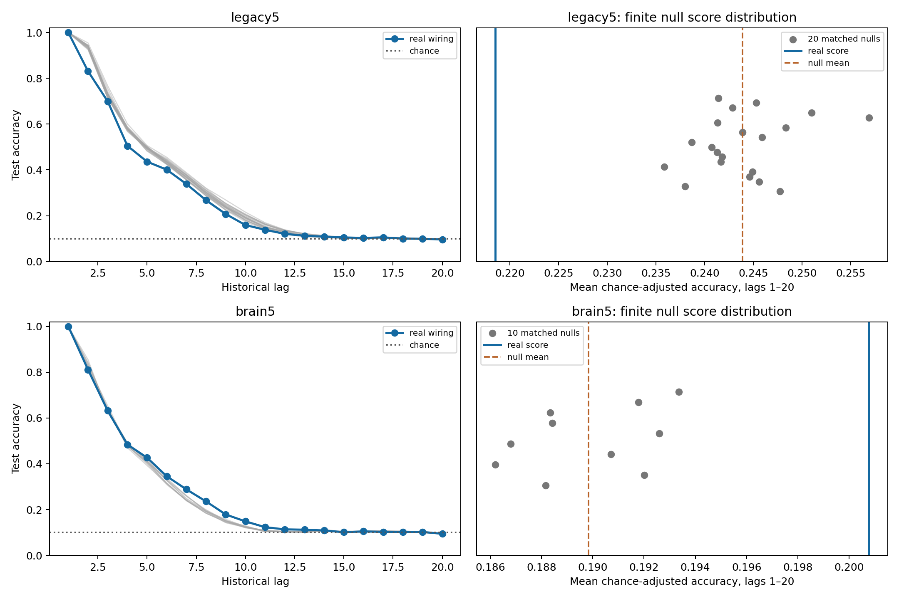

# P2: real wiring versus matched TDC null ensembles — results

**The registered real-wiring advantage criterion fails in the primary partial
analysis and the secondary whole-brain analysis.** The partial real graph scores
below all 20 nulls. The whole-brain real graph scores above all 10 nulls, but its
mean raw-accuracy difference is only 0.985 pp, below the registered2.7 pp material
effect requirement. The positive secondary direction is preserved; it is not
promoted to a successful registered hypothesis.

## Registration, pairing and endpoint

[Protocol](temporal-null-ensemble-protocol.md) and
[config](../configs/temporal_null_ensemble.json) were committed as `68eb469`
after P1 closure and before null generation/outcomes. P1 real results were
already known; this is not an outcome-blind registration of the whole pair.
Initial implementation is `2468741`; console-only correction is `d5eac62`.
Main source commit: `8cb3aef4fa75910e8e253fcfd61dfa83c672d9eb`.

One real `legacy5` graph versus 20 independently seeded nulls, with all six P1
input/data blocks; one real `brain5` versus 10 nulls, with the first three P1
blocks by numeric order. The same iid K10 train 4,000/test 2,000, warmup 200,
source input/observation root IDs,48 MBONs, gain.9/leak.6 incoming-L1,
`mbon_after_kc`, alpha-1 ridge and 490 decoder parameters per lag apply in every
matched case. Original graph arrays reproduce the sealed P1 arrays exactly.
Recurrent weights remain fixed; no autonomous feedback/internal learning.

Score is the equal-weight mean `(accuracy−.1)/.9` over lag 1–20 and the fixed
blocks, without clipping. Lag0 is sanity only. PASS requires real strictly
above every null and real−null mean≥.03 adjusted-score units, equivalent to
2.7 pp raw mean accuracy. Both gates are independently recomputed with exact
integer-count fractions. No lag, metric, seed, threshold or null count changed.

## Finite null distribution

| analysis | real score | null mean | null median | null sample SD | null min–max | empirical percentile | standardized effect | registered status |
| --- | ---: | ---: | ---: | ---: | --- | ---: | ---: | --- |
| partial,20 nulls/6 blocks | .218491 | .243881 | .243363 | .004767 | .235833–.256875 | 0 | −5.327 | FAIL |
| whole brain,10 nulls/3 blocks | .200778 | .189836 | .189569 | .002555 | .186194–.193352 | 100 | +4.283 | FAIL |

| analysis | real raw mean accuracy | null raw mean accuracy | real−null mean (pp) | required gap (pp) |
| --- | ---: | ---: | ---: | ---: |
| partial | 29.664% | 31.949% | −2.285 | ≥2.700, and above every null |
| whole brain | 28.070% | 27.085% | +0.985 | ≥2.700, and above every null |

Percentile is the registered finite rank, with half weight for ties. Effects
are standardized against the small conditional null ensemble, not animal
variation. A large standardized effect or100th percentile does not override
the prospectively required absolute magnitude. No biological-population
p-value, equivalence claim or universal optimality statement is made.



[Every graph score](../results/tdc_v2/p2_main/graph-scores.csv),
[every paired input-block score](../results/tdc_v2/p2_main/seed-scores.csv),
[paired real−null values](../results/tdc_v2/p2_main/paired-seed-differences.csv),
[every lag's real−null-mean difference](../results/tdc_v2/p2_main/lag-differences.csv), and
[all raw per-case correct counts/baselines](../results/tdc_v2/p2_main/raw-lags.csv)
retain all planned data. Differences are not uniform across lag. Partial
lag 2 real−null mean is−10.724 pp and lag 5−5.868 pp. Whole-brain lag 2 is−1.722 pp,
lag 5+1.912 pp and lag 8+4.482 pp. These descriptive points do not replace the
registered20-lag scalar. Whole-brain results use3 blocks, not P1's 6-block mean.

## Structural audits

[Active30-graph ensemble](../results/tdc_v2/p2_graphs_retry/manifest.json) and
[independent structural verification](../results/tdc_v2/p2_graph_validation_retry/checks.json)
confirm every neuron's in/out degree, exact pre/post role-block counts,
presynaptic signed raw outgoing-weight multisets, global weights and absence
of self/duplicate/zero edges. Every requested swap is accepted:16,545 per
partial graph and 2,700,513 per whole-brain graph. Every fixed-seed null is
independently regenerated by a separate swap implementation and matches exactly.
Pinned parquet/annotation reconstruction also confirms the source graph and
induced partial graph. Detailed [member audits](../results/tdc_v2/p2_graphs_retry/structural-audits.json)
include per-block overlap and incoming-strength changes.

Original-edge overlap is48.534–50.166% in partial controls and 13.986–14.046%
in whole-brain controls. Finite accepted swaps and strong degree/role constraints
are not uniform or fully mixed sampling of all possible graphs. Original/null
raw graphs are normalized independently by the same incoming-L1 rule. Thus
the contrast includes graph-dependent row normalization; normalized outgoing
weight multisets are not preserved. No new biological sign/physiology claim.

## Complete replay, resources and retained failure

Main:159 cases,3,339 lag heads and 318 separate train/test streams.
[Independent validation](../results/tdc_v2/p2_main_validation/checks.json) rebuilds
both stream trajectories manually, refits every head by augmented least squares,
checks every label/control/prediction and recomputes all scalar/rank/difference
summaries and both FAIL decisions. All318 full-state trajectory hashes match
exactly, including unobserved coordinates. All nine rerun real cases match P1
arrays exactly. Validation completed; no execution or verification remains.

Main manifest SHA256:
`8b6f5ecd57dc621a5bdd7fcda98d6bfd6ec14c57c7329a9db0d6ca30cb8f180b`.
[Main manifest](../results/tdc_v2/p2_main/manifest.json) and
[validation manifest](../results/tdc_v2/p2_main_validation/manifest.json) preserve
config/protocol/source/environment/graph/data/model/array hashes and raw evidence.

| stage | runtime (s) | sampled aggregate process-tree peak (bytes) |
| --- | ---: | ---: |
| graph generation retry | 381.92 pool time | 2,393,001,984 |
| independent graph regeneration | 588.11 pool time | 2,619,744,256 |
| main | 1,629.29 overall | 1,077,927,936 |
| independent main validation | 1,380.57 overall | 1,176,801,280 |

Parent/worker timing and OS process lifetime peak working sets are also saved.
Aggregate peaks sum live RSS at 50ms intervals, including shared pages; they
are not exact OS aggregate peaks. All complete stages are within2 h/4 GiB budgets.

The [first graph attempt](../results/tdc_v2/p2_graphs/manifest.json) is incomplete
and excluded. A progress-printer em dash failed under Windows CP949 before
any neural score.24 completed member graphs, two interrupted-worker records,
the exception, config and parent/completed-worker resource records are retained.
Aggregate-tree peak was not exported after that logging error and is explicitly
unavailable. Only the progress character was changed to ASCII. The same seeds,
swap budgets and scientific settings were rerun into a fresh namespace.
[Identity audit](../results/tdc_v2/p2_retry_identity_audit/checks.json) verifies
all 24 previously completed raw graphs and structural audits are byte-identical,
and that the only code difference was the printer character. They are duplicate
realizations, not24 extra independent nulls. Successful smoke and full smoke
validation preceded main; smoke scores are excluded from the main statistics.

## Interpretation and closure

The model retains historical input information, but the primary real partial
wiring is not specially advantageous here; all matched nulls decode more on
the registered scalar. The whole-brain comparison shows a small conditional
positive direction with a different lag profile, below the fixed material
criterion. Preserve both directions and both failures. Generic matched
recurrence/roles/weights are sufficient for substantial TDC in these controls;
this is not proof that fine wiring never matters or that graphs are equivalent.
No general real-wiring or whole-brain superiority, storage-site identification,
biological learning or formal memory capacity is established. v1 negatives
remain unchanged. P2 is closed and no P3 work was performed.

## Reproduction with fresh paths

Python 3.12, `requirements-act1-lock.txt`, pinned raw/cache paths from P1.
Committed P1 parent artifacts are required. Run from the repository root:

```powershell
$env:PYTHONPATH = 'src;scripts'
$env:OPENBLAS_NUM_THREADS = '1'
$env:OMP_NUM_THREADS = '1'
$env:MKL_NUM_THREADS = '1'
python -m flying.training.phase6 prepare --raw outputs/tdc_v2/raw --cache outputs/tdc_v2/whole_cache
python scripts/temporal_null_ensemble.py prepare --out results/tdc_v2/replay_p2_graphs
python scripts/verify_temporal_null_ensemble.py graphs results/tdc_v2/replay_p2_graphs --out results/tdc_v2/replay_p2_graph_validation
python scripts/temporal_null_ensemble.py run --smoke --graphs results/tdc_v2/replay_p2_graphs --graph-validation results/tdc_v2/replay_p2_graph_validation --out results/tdc_v2/replay_p2_smoke
python scripts/verify_temporal_null_ensemble.py run results/tdc_v2/replay_p2_smoke --out results/tdc_v2/replay_p2_smoke_validation
python scripts/temporal_null_ensemble.py run --graphs results/tdc_v2/replay_p2_graphs --graph-validation results/tdc_v2/replay_p2_graph_validation --out results/tdc_v2/replay_p2_main
python scripts/verify_temporal_null_ensemble.py run results/tdc_v2/replay_p2_main --out results/tdc_v2/replay_p2_main_validation
```

Every stage rejects existing output directories. Historical strict source replay
uses the recorded revision/environment; do not refresh old hashes.
