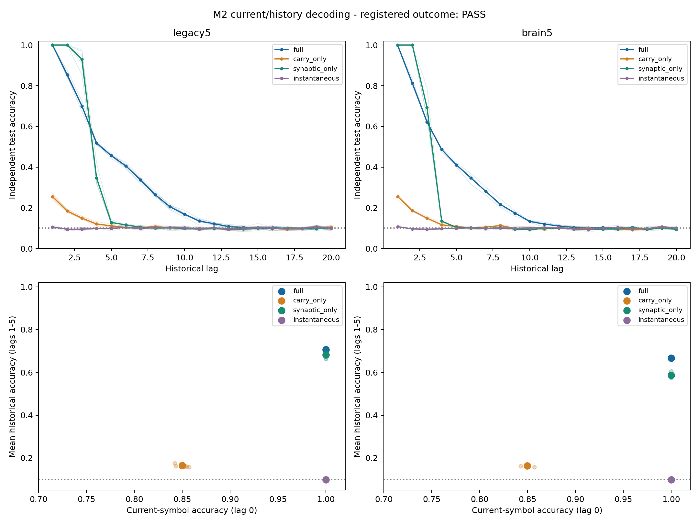

# M2: joint current/history decoding tradeoff — results and synthesis

Date: 2026-10-08. **Registered joint primary: PASS**, independently verified.
All planned execution/verification is complete. This is the specific
carry_only−instantaneous current/history question on fresh fixed streams.
**M1 remains assay-invalid with its original endpoint undefined.**

[Protocol](temporal-tradeoff-protocol.md) and
[config](../configs/temporal_tradeoff.json) were committed as `7552c234`
before M2 neural outcomes. Main source commit: `7a70b1d5301115e60831721c21c0bd78abf81e6b`.
New namespace: `results/tdc_tradeoff_v1/`; baseline `e52d1ff`.
The question, predicted directions and lag1–5 focus were informed by M1;
this is prospective fresh-data confirmation, not a blind discovery or M1 rescue.

## 1. What question was asked?

Does direct carry, with previous-state synaptic drive disabled, improve
historical iid input decoding while reducing current-symbol decoding compared
with a history-free instantaneous reference? The two labels are decoded with
separately fitted, equally budgeted linear readouts. Joint refers to the
conjunction of their observed changes, not a joint multitask decoder.

The frozen M1 dynamics/encoder/readout are reused: drive.6, carry.4 when enabled,
incoming-L1 gain.9, amplitude.5/fraction.1, `mbon_after_kc`; all arms retain the
same current KC-to-MBON block and normalization. Full, carry_only, synaptic_only
and instantaneous are all reported. R still includes delayed feedforward
transmission as well as anatomical feedback cycles. No coefficients or decoder
architecture were changed in response to outcomes.

Primary legacy5 circuit701:686 neurons/3,309 edges, six new blocks1200001–1200006.
Secondary brain5:138,639 neurons/2,700,513 edges, first three paired blocks.
Mapping1210001–1210006, independent train1220001–1220006 and test1230001–1230006
seeds were fixed prospectively. Uniform iid K10, reset each stream independently,
warmup200, train4,000/test2,000 scored rows per lag0–20. Same48 observed source
MBONs, paired inputs/source IDs and490-parameter alpha1 affine ridge per lag;
train-only standardization and predictor fitting. Only external readouts learn.
The three whole blocks are not three extra independent inputs; do not pool
the cohorts as nine independent blocks.

## 2. What was confirmed?

H is unweighted mean chance-adjusted accuracy over lag1–5, `(accuracy-.1)/.9`,
unclipped. C is raw lag0 accuracy. Relative to instantaneous, primary requires
mean dH>=.03, mean dC<=-.05, dH>0 and dC<0 in every one of the six blocks.
The instantaneous reference must have current accuracy>=.99 and an analytical
all-coordinate no-history certificate. Its current accuracy is100% in all
blocks; all reference and technical validity checks pass.

| Registered component | Partial primary | Whole secondary | Requirement |
| --- | ---: | ---: | --- |
| Mean dH, adjusted | .0729074 (`3937/54000`) | .0713333 (`107/1500`) | >=.03 |
| Raw historical mean gain | +6.5617 pp | +6.4200 pp | >=2.7 pp |
| Mean dC, raw | −.150250 (`−601/4000`) | −.150333 (`−451/3000`) | <=−.05 |
| Raw current mean change | −15.0250 pp | −15.0333 pp | <=−5 pp |
| Both strict paired directions | 6/6 | 3/3 | Every registered block |
| Registered joint status | **PASS** | **PASS**, secondary | All conditions together |

Exact count fractions adjudicate threshold equality; no floating ambiguity or
post-outcome threshold change. Both effects pass independently and jointly.
Whole secondary cannot replace primary and establishes no whole-brain advantage.

| Graph / dimension | Mean | Median | Sample SD | Bootstrap 2.5–97.5% |
| --- | ---: | ---: | ---: | --- |
| Partial dH adjusted | .072907 | .069944 | .008004 | [.067740, .079167] |
| Partial dC raw | −.150250 | −.149000 | .006195 | [−.154833, −.145833] |
| Whole dH adjusted | .071333 | .070000 | .006328 | [.065778, .078222] |
| Whole dC raw | −.150333 | −.151000 | .007024 | [−.157000, −.143000] |

These10,000-draw intervals resample paired computational blocks using seed1240001;
they are descriptive, not biological population confidence intervals.
Partial historical raw interval is[+6.0966,+7.1250]pp; current interval
[−15.4833,−14.5833]pp. All paired values are preserved:

| Block | Partial dH adjusted | Partial dC (pp) | Whole dH adjusted | Whole dC (pp) |
| --- | ---: | ---: | ---: | ---: |
| 1200001 | .065778 | −14.30 | .065778 | −14.30 |
| 1200002 | .078333 | −15.10 | .078222 | −15.10 |
| 1200003 | .070000 | −15.70 | .070000 | −15.70 |
| 1200004 | .066889 | −14.55 | outside fixed scope | outside fixed scope |
| 1200005 | .086556 | −15.80 | outside fixed scope | outside fixed scope |
| 1200006 | .069889 | −14.70 | outside fixed scope | outside fixed scope |

[Raw per-lag counts](../results/tdc_tradeoff_v1/main/raw-lags.csv),
[exact paired fractions](../results/tdc_tradeoff_v1/main/paired-tradeoff.csv),
[arm scores](../results/tdc_tradeoff_v1/main/arm-scores.csv),
[all descriptive pairwise contrasts](../results/tdc_tradeoff_v1/main/descriptive-pairwise.csv),
[full curve summaries](../results/tdc_tradeoff_v1/main/curve-summary.csv).
Frequency/current-symbol-only baselines and baseline excess are reported at
every lag. Finite iid reference fluctuations around10% are not an empirical
validity gate and are not clipped into positive scores.

## All arms and prespecified diagnostics

| Graph / arm | Current accuracy (%) | Historical lag1–5 mean (%) | Historical lag1–20 mean (%) |
| --- | ---: | ---: | ---: |
| Partial full | 100.000 | 70.5867 | 29.8992 |
| Partial carry_only | 84.975 | 16.4333 | 11.6671 |
| Partial synaptic_only | 100.000 | 68.1350 | 24.5492 |
| Partial instantaneous | 100.000 | 9.8717 | 9.9975 |
| Whole full | 100.000 | 66.6200 | 27.5775 |
| Whole carry_only | 84.9667 | 16.3200 | 11.5925 |
| Whole synaptic_only | 100.000 | 58.6400 | 21.9967 |
| Whole instantaneous | 100.000 | 9.9000 | 9.9992 |



Thin curves/small points are individual blocks; thick curves/large points are
means. Bottom y uses raw lag1–5 historical accuracy, not adjusted H. Current
lag0 remains separate. The figure's current axis spans.70–1.02; every registered
point lies inside that range. Full and synaptic_only maintain100% current
accuracy alongside substantial historical decoding. **These results do not
support a universal requirement to sacrifice current access to preserve history.**
They confirm the bounded carry_only−instantaneous comparison.

The following rates are **pooled count-derived proportions within each cohort**,
not means of block rates. Repeat means current symbol equals the actual previous
symbol; switch means it differs. No additional fitting or gate uses these probes.

| Carry-only diagnostic | Partial (six blocks) | Whole (first three) |
| --- | ---: | ---: |
| Current correct / trials | 10,197 /12,000 (84.975%) | 5,098 /6,000 (84.9667%) |
| Repeat correct / trials | 1,251 /1,251 (100%) | 628 /628 (100%) |
| Switch correct / trials | 8,946 /10,749 (83.2263%) | 4,470 /5,372 (83.2092%) |
| Current errors predicting actual previous symbol | 1,803 /1,803 (100%) | 902 /902 (100%) |

For comparison, switch accuracy averaged over blocks is83.2228% partial /
83.2051% whole. Other arms have no current errors; the error-conditioned
previous-symbol fraction is null, not zero. The association is consistent with
current/previous-label confusion under this intervention, and does not identify
a unique causal mechanism or storage site. Do not assign a10% null to this
error-conditioned fraction. [Raw diagnostics](../results/tdc_tradeoff_v1/main/diagnostics.csv)
and each case's10x10 current-symbol confusion counts are preserved.

## Independent validation and reproducibility

[Main verifier](../results/tdc_tradeoff_v1/main_validation/checks.json) independently
reconstructs graphs from pinned sources, roles/inputs, both state trajectories,
split-safe labels, training normalization, augmented-SVD ridge fits, controls,
predictions, all summaries/paired bootstraps, confusion and diagnostic counts.
All72 complete-state trajectory hashes match exactly, including unobserved
coordinates. All756 heads and predictions agree;36 diagnostics,9 full-coordinate
instantaneous certificates and36 shared zero-state response certificates pass.
The wrapper imports the frozen independent M1 graph/dynamics/refit helper, and
implements its own M2 endpoint/summary/diagnostic logic without runner imports.
Nested `state_refit` evidence is sealed before the containing M2 case is sealed.

[Main manifest](../results/tdc_tradeoff_v1/main/manifest.json) SHA256:
`d0c112119f47ebc80727d40e864e3da402321af44a6493c32e2febe4aec90321`.
[Source/environment hashes](../results/tdc_tradeoff_v1/main/source.json),
[source graph audit](../results/tdc_tradeoff_v1/main_validation/source-graph-audit.json),
[10 safeguards](../results/tdc_tradeoff_v1/guard_tests/checks.json),
[smoke validation](../results/tdc_tradeoff_v1/smoke_validation/checks.json),
[final provenance/history/count audit](../results/tdc_tradeoff_v1/final_audit/audit.json).

| Completed stage | Wall seconds | Sampled process-tree peak bytes |
| --- | ---: | ---: |
| Smoke | 33.50 | 1,105,047,552 |
| Independent smoke | 32.22 | 1,092,423,680 |
| Main | 418.34 | 978,771,968 |
| Independent main | 428.31 | 1,071,300,608 |

All stages fit the fixed two-hour/4GiB budget with four workers and one numerical
thread each. Tree RSS is sampled50ms and sums live processes, possibly counting
shared pages twice; it is not exact system peak memory. Parent lifetime
RSS/Windows working-set and per-job measurements are separately archived.
Main parent OS peak184,741,888 bytes; independent main584,474,624 bytes.
No M2 execution/validation attempt failed; all older failure records remain.
Smoke8 cases/16 traces/168 refits is technical evidence excluded from main.

Use recorded Python3.12.10, NumPy2.3.5, SciPy1.17.0, Windows11,
OpenBLAS0.3.30/one thread, and the recorded graph/raw-source hashes. Cache/source
preparation is in [P1 reproduction](temporal-memory-curve-results.md#reproduction).
All output names must be fresh; no destination is overwritten.

```powershell
$env:PYTHONPATH = 'src;scripts'
$env:OPENBLAS_NUM_THREADS = '1'
$env:OMP_NUM_THREADS = '1'
$env:MKL_NUM_THREADS = '1'
python scripts/temporal_tradeoff.py --smoke --out results/tdc_tradeoff_v1/replay_smoke
python scripts/verify_temporal_tradeoff.py results/tdc_tradeoff_v1/replay_smoke --out results/tdc_tradeoff_v1/replay_smoke_validation
python scripts/temporal_tradeoff.py --out results/tdc_tradeoff_v1/replay_main
python scripts/verify_temporal_tradeoff.py results/tdc_tradeoff_v1/replay_main --out results/tdc_tradeoff_v1/replay_main_validation
python -m pytest -q tests/test_temporal_mechanism.py tests/test_temporal_tradeoff.py
```

The final auditor closes this actual registered run. Strict replay uses recorded
source/environment; no new fitted architecture, tuning or extra seed is a
completion step.

## 3. What failed or remains unconfirmed?

M2's registered conjunction and technical checks have no failure. M1's original
all-arm90% eligibility criterion still failed, its synaptic-increment endpoint
remains undefined, and M2 cannot retrospectively confirm it. Current/history
decodability changes do not demonstrate a conserved information budget,
simultaneous-decoding impossibility, an unavoidable cost of memory or biological
resource competition. Full/synaptic_only's high current and history access
specifically limit a universal tradeoff interpretation. Feedback-cycle
localization, real-wiring superiority and physiology were not tested here.

## 4. What can now be said about DrosoMem?

The core claim remains that a fixed source-derived fly-connectome computational
reservoir retains decodable past-input information. M2 adds prospective evidence
that the specific direct-carry-only intervention changes current and short-past
access in opposite directions through this fixed linear readout interface.
It does not identify biological memory storage or physiological learning.
TDC is an operational accuracy curve, not formal Shannon/reservoir capacity.

[Baseline audit](../results/tdc_tradeoff_v1/baseline_audit/checks.json) seals all42,717
prior result-file Git identities, including all702 M1 artifacts and failures.
Old numerical source/data/config/protocols/tests remain unchanged. Sparse-excluded
historical results are protected by Git identity, not claimed newly replayed.
[M1](temporal-mechanism-results.md) remains assay-invalid;
[P1/P2](temporal-memory-synthesis.md) retains short-lag iid evidence and both
failed real-wiring material gates, including whole's positive+0.985pp direction
below its2.7pp requirement. No general whole-brain or real-wiring advantage.

This finite M2 scope is closed. The next separate candidate is delayed
feedforward propagation versus anatomical feedback cycles under input-access
preserving controls. It needs its own prospective protocol/budget/validity
checks and is unregistered/unexecuted here. P3 physiology/plasticity stays outside
this work; no automatic seed, decoder or coefficient sweep follows M2.

## 비전공자를 위한 한국어 요약

**질문:** 상태에 이전 입력의 흔적을 남기면, 과거 숫자를 더 잘 읽는 대신 지금
숫자를 덜 정확히 읽게 되는지 새 무작위 입력으로 확인했습니다.

**확인:** 부분망에서 상태 잔존 조건의 과거1–5단계 평균 정확도는16.43%로,
순간 입력 조건의9.87%보다 높았습니다. 현재 정확도는84.98% 대100%였습니다.
두 변화가 미리 정한 기준을 넘고 여섯 seed 모두 같은 방향이어서 이번 M2는
통과했습니다. 실험과 별도 재계산도 일치했습니다.

**실패·한계:** 앞선 M1의 검사 요건 실패는 그대로입니다. 다른 두 조건은
현재 숫자를100% 읽으면서 과거도 잘 읽었습니다. 따라서 기억하려면 반드시
현재 숫자를 덜 잘 읽어야 한다는 일반 원리로 해석할 수 없습니다.

**현재 결론:** 특정 계산 모델·조건·decoder에서 나타난 정확도 변화를 확인한
것입니다. 실제 초파리의 기억 위치나 생물학적 학습을 입증한 결과는 아닙니다.
