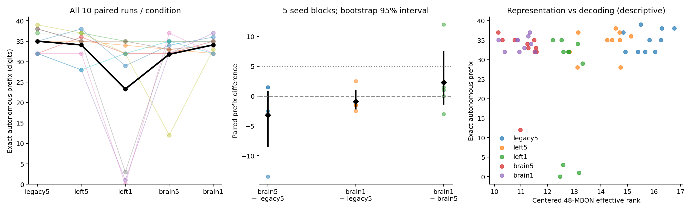
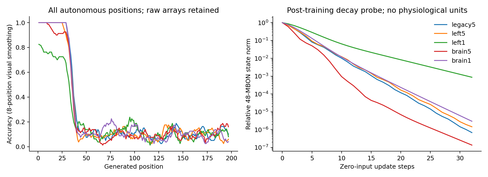

# ACT I — whole-brain memory results

**Whole-brain connectivity did not improve autonomous recall under the locked
matched-observation design.** Mean Pi Memory Score was 35.0 for legacy5, 31.8
for brain5 and 34.1 for brain1. Neither whole-brain condition passes the
predeclared improvement criterion. This is a negative result for this model,
dataset and budget, not evidence that biological whole brains cannot remember.

## Design and provenance

Protocol committed **186a5f6** before smoke/main outcomes; implementation
**cb4d435**. [Protocol](whole-brain-memory-protocol.md),
[exact config](../configs/whole_brain_memory.json),
[main manifest](../results/act1_main/manifest.json),
[analysis manifest](../results/act1_analysis_v2/manifest.json).

The v2 analysis corrects only moving-average plot boundary normalization.
Numeric summaries are identical to the preserved first analysis; no run, metric
or decision rule changed. Original analysis artifacts remain in act1_analysis.

Five graph levels × two input-map strata × seeds **7142–7146** = **50 fits**.
Both strata come from the same connectome, sharing the 48 observed left MBONs.
One nonlinear-head initialization per seed using SeedSequence([seed,9901,0]).
No sweeps, outcome-based exclusions or early stopping.

All graphs use the existing frozen rate dynamics: incoming-L1 gain .9, leak .6,
mbon_after_kc updates. Pi indices 0–199 include leading 3; prompt 314;
199 teacher-forced training pairs and 197 autonomous generated digits.
Fixed 48→8 tanh→10 head, 482 parameters, full-batch Adam for 2,000 updates,
LR .03, L2=1e-5, first 32 generated targets weighted 4×, train-only scaling.
Exact stimulated KC IDs/amplitudes and observed MBON IDs/order match across
levels. Added neurons receive no additional external input. Targets never enter
the autonomous generator. All 197 outputs are saved even after the first error.

| Graph | Nodes | Directed edges | Minimum contacts |
|---|---:|---:|---:|
| legacy5, s701 / s702 | 686 | 3,309 / 3,241 | 5 |
| left5 | 2,795 | 15,120 | 5 |
| left1 | 2,795 | 233,900 | 1 |
| brain5 | 138,639 | 2,700,513 | 5 |
| brain1 | 138,639 | 15,091,983 | 1 |

The source is the pinned author-distributed v783 graph; source hashes, exact
root IDs and cache hashes are included in every run manifest. Whole-brain here
describes node/edge coverage, not physiological completeness.

## All raw scores

Scores exclude prompt and stop counting at first error, capped at 197.
[CSV](../results/act1_analysis_v2/raw-seed-table.csv) and
[all metrics](../results/act1_main/evaluations.csv).

| Input-map stratum | Seed | legacy5 | left5 | left1 | brain5 | brain1 |
|---|---:|---:|---:|---:|---:|---:|
| 701 | 7142 | 35 | 38 | 29 | 34 | 36 |
| 701 | 7143 | 35 | 35 | 34 | 33 | 32 |
| 701 | 7144 | 37 | 37 | 35 | 35 | 35 |
| 701 | 7145 | 32 | 36 | 32 | 32 | 35 |
| 701 | 7146 | 32 | 28 | 1 | 32 | 37 |
| 702 | 7142 | 38 | 35 | 35 | 33 | 34 |
| 702 | 7143 | 32 | 32 | 0 | 37 | 32 |
| 702 | 7144 | 38 | 35 | 3 | 35 | 35 |
| 702 | 7145 | 39 | 37 | 32 | 12 | 33 |
| 702 | 7146 | 32 | 28 | 32 | 35 | 32 |

| Condition | Raw mean | Raw median | Raw sample variance | 95% bootstrap interval of mean |
|---|---:|---:|---:|---|
| legacy5 | 35.0 | 35.0 | 8.22 | [33.2, 36.7] |
| left5 | 34.1 | 35.0 | 12.99 | [30.8, 36.4] |
| left1 | 23.3 | 32.0 | 233.34 | [17.2, 29.4] |
| brain5 | 31.8 | 33.5 | 50.84 | [26.9, 34.7] |
| brain1 | 34.1 | 34.5 | 3.21 | [33.0, 34.9] |

Raw median/variance above describe ten runs; intervals resample **five seed
blocks**, averaging the two strata within each seed. Seed-block medians and
variances are also saved in [summary.json](../results/act1_analysis_v2/summary.json).
10,000 paired bootstrap resamples, seed 7199. These are descriptive small-sample
intervals, not biological confidence limits.

## Paired effects and locked decisions

| Contrast | Mean delta | Median delta | 95% paired interval | d_z | Block W/T/L |
|---|---:|---:|---|---:|---|
| brain5 − legacy5 | −3.2 | −2.5 | [−8.4, 0.7] | −0.52 | 2/0/3 |
| brain1 − legacy5 | −0.9 | −1.5 | [−2.1, 0.9] | −0.46 | 1/0/4 |
| brain1 − brain5 | +2.3 | +1.0 | [−1.3, 7.5] | +0.40 | 3/1/1 |
| left5 − legacy5 | −0.9 | 0.0 | [−2.5, 0.4] | −0.46 | 1/2/2 |
| left1 − left5 | −10.8 | −11.5 | [−15.7, −5.9] | −1.76 | 0/0/5 |
| brain5 − left5 | −2.3 | −1.0 | [−9.0, 2.9] | −0.31 | 2/0/3 |
| brain1 − left1 | +10.8 | +15.0 | [5.0, 16.6] | +1.41 | 5/0/0 |

[Every paired seed delta](../results/act1_analysis_v2/paired-differences.csv).
The main criterion was mean gain >=5 digits and positive differences in >=4/5
blocks. Both main comparisons fail; the separately specified whole-brain
weak-edge criterion also fails. The positive brain1−left1 diagnostic does not
replace the failed comparison against legacy5. No p-value gate or success
criterion was changed.



## Representation and decoding diagnostics

| Graph | Next-digit training accuracy | Teacher-forced scored accuracy | Autonomous position accuracy | Centered raw MBON effective rank |
|---|---:|---:|---:|---:|
| legacy5 | 83.52% | 83.65% | 25.99% | 15.75 |
| left5 | 81.71% | 81.88% | 25.08% | 14.16 |
| left1 | 78.14% | 78.48% | 21.42% | 12.76 |
| brain5 | 80.30% | 80.41% | 24.52% | 11.09 |
| brain1 | 77.14% | 77.31% | 25.74% | 10.99 |

More active neurons did not yield more diverse observations or longer exact
recall in this configuration. Average active counts (|state|>1e-8) were
642, 2,703, 2,781, 81,589 and 110,592 respectively. These are rate-state
threshold counts, **not spikes**, and cannot be compared directly with Phase 6
LIF active-neuron counts.

Raw centered rank depends on feature amplitude. The additional standardized
feature diagnostic gives ranks 19.49, 19.46, 14.18, 19.20 and 14.40.
Thus brain5's raw-rank decrease mostly changes interpretation after train
standardization; do not attribute its recall score causally to raw rank alone.
Brain5 averaged 2.6 features below the fixed 1e-5 standard-deviation floor;
other conditions had none. These descriptive measures do not locate memory.

Weak-edge restoration in the left-only graph reduced recall in every seed block,
despite slower state-norm decay: average observed half-decay was 4 update steps
for left1 versus 2.1 for left5. The 32-step relative observed norm was 8.68e-4
for left1, versus 1.45e-6 for left5, 6.85e-7 for legacy5, 1.36e-7 for brain5
and 2.96e-6 for brain1. Larger persistence is not sufficient for useful sequence
decoding. These update steps have no calibrated biological duration.

Expansion and weak edges interact: brain1 recovered the left1 deficit, but did
not exceed legacy5. Per-graph incoming normalization also changes old-edge
strengths, so scale, restored feedback, normalization and accessible feature
geometry are not fully causally separated. The ladder narrows explanations;
it does not identify the causal pathway.

All runs save training curves, 48-MBON training/recall trajectories, per-position
accuracy, regional accuracy, 10-way probabilities, singular values, activity,
cosine similarities and decay probes.
[Detailed diagnostics](../results/act1_analysis_v2/diagnostics.csv),
[standardized-state diagnostics](../results/act1_analysis_v2/representation-diagnostics.csv).



## Engineering and validation

Fresh Windows 11 / Python 3.12.10 rate environment; NumPy 2.3.5, SciPy 1.17.0,
pandas 2.2.3, mpmath 1.4.1, psutil 7.2.2; one numerical thread.
Exact versions: [lock](../requirements-act1-lock.txt). CPU/platform, RAM and BLAS
metadata are recorded per run, rather than inferred from this summary.

| Graph | Mean model/load/train/recall seconds | Maximum sampled worker-tree MiB |
|---|---:|---:|
| legacy5 | 0.73 | 112.6 |
| left5 | 0.78 | 126.5 |
| left1 | 1.65 | 453.4 |
| brain5 | 6.88 | 246.7 |
| brain1 | 19.74 | 970.8 |

Total supervised main-worker wall time: 368.59 seconds including interpreter
startup. Graph download/preparation took 34.29 seconds separately. left1 loads
the complete sparse graph before slicing, which explains its higher build
memory than left5. Peak memory is .2-second sampled RSS, not an exact allocator
maximum. No run hit 3 GiB or 1,800 seconds. No dense N×N or T×all-neuron trace.

Smoke used five conditions, stratum 701, seed7139, length40/horizon37 and 20
updates; five exact replays and five independent refits passed. Its scores
are excluded from all main statistics. Main verification rebuilds every
trajectory and replays every saved head; first-seed/first-stratum heads are
independently refitted. The verification artifact is the authoritative
completion record. [Smoke verification](../results/act1_smoke/verification-refit.json),
[main verification](../results/act1_main/verification-refit.json).
Tests: **132 passed, 8 optional-dependency skips**, including six new tests for
legacy parity, ID remapping, corrupted-cache rejection, target-free rollout,
decay reset and invalid configuration. Brian2 is not installed in this
rate-only environment; no new LIF validation is claimed.

## Limits, negative findings and claims

This establishes a reproducible negative ACT I result for a rate model with
fixed sparse KC stimulation, 48 left MBON observations, a fixed-prefix-trained
external head, length200 and offset0. It does not establish equivalence, a
universal absence of whole-brain benefit or a formal memory-capacity bound.
Many scores occur near the favored 32-target window.

It does **not** show unseen-pi prediction, arbitrary-sequence generalization,
physiological realism, topology superiority over matched random networks,
biological memory localization, or experience-driven learning inside the
connectome. No main recurrent weights were trained.
The repeated computational seeds are not independent biological connectomes.

Following the locked negative branch, no fresh-seed positive confirmation or
offset1000 confirmation was run, and no hyperparameter tuning was performed.
Exact replay/refit is numerical verification, not a positive-result confirmation.

## Reproduce without overwriting

From repository root with the locked environment and PYTHONPATH=src:

```powershell
python scripts/reproduce_act1_baseline.py --out outputs/act1_baseline_new
python -m flying.training.phase6 prepare --cache outputs/act1-graphs
python -m flying.training.whole_brain_memory run --out outputs/act1_new
python -m flying.training.whole_brain_memory verify --out outputs/act1_new --refit
python scripts/summarize_whole_brain_memory.py --source outputs/act1_new --out outputs/act1_analysis_new
python -m pytest -q
```

For the recorded main artifacts, verification uses results/act1_main and refuses
changed numerical source, protocol or config. Existing verification files are
not overwritten; use a copy of the run excluding the prior verification file
for another check, or generate a fresh run. Each checkpoint has its own
manifest, and the root manifest hashes every run/log/resource artifact.
Source context commit may differ after documentation/results commits; exact
numerical-source/protocol hashes must still match.

## Next highest-information experiment — one

A preregistered **four-family ACT II comparison of legacy5 and brain1**:
pi, seeded iid digits, shuffled pi with preserved digit multiset, and a periodic
sequence; identical symbol length, input/observation budget and optimizer.
This directly asks whether the observed near-32 prefix behavior is specific to
pi ordering or recurs across arbitrary versus predictable sequences.
It has not been executed here; no topology-superiority claim follows without
additional matched structural controls.
